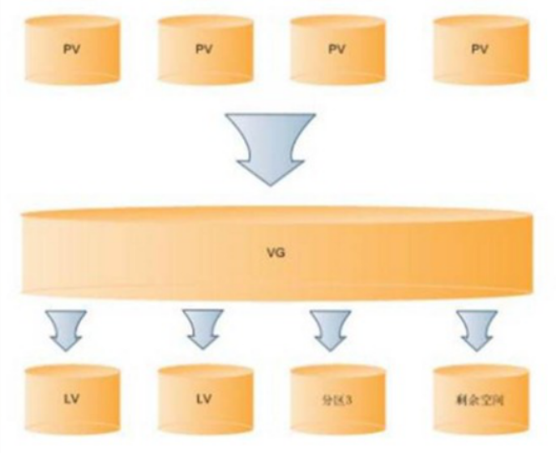

# 十.磁盘管理-LVM

## 1.基础知识
### 1.1 lvm是什么,为什么要用
逻辑卷管理（Logical volume management，LVM），为计算机中的大量存储设备（Mass storage devices）提供更有弹性的硬盘分区方式。它是一种抽象化存储技术，实现的方式，根据操作系统而有所不同。基本上，它是在驱动程序与操作系统之间增加一个逻辑层，以方便系统管理硬盘分区系统。


### 1.2 lvm基本术语
* **物理存储介质（The physical media）**：这里指系统的存储设备：硬盘，如：/dev/hda1、/dev/sda等等，是存储系统最低层的存储单元。 
* **物理卷（physical volume）**：物理卷就是指硬盘分区或从逻辑上与磁盘分区具有同样功能的设备(如RAID)，是LVM的基本存储逻辑块，但和基本的物理存储介质（如分区、磁盘等）比较，却包含有与LVM相关的管理参数。 
* **卷组（Volume Group）**：LVM卷组类似于非LVM系统中的物理硬盘，其由物理卷组成。可以在卷组上创建一个或多个“LVM分区”（逻辑卷），LVM卷组由一个或多个物理卷组成。 
* **逻辑卷（logical volume）**：LVM的逻辑卷类似于非LVM系统中的硬盘分区，在逻辑卷之上可以建立文件系统(比如/home或者/usr等)。 
* **PE（physical extent）**：每一个物理卷被划分为称为PE(Physical Extents)的基本单元，具有唯一编号的PE是可以被LVM寻址的最小单元。PE的大小是可配置的，默认为4MB。 
* **LE（logical extent）**：逻辑卷也被划分为被称为LE(Logical Extents) 的可被寻址的基本单位。在同一个卷组中，LE的大小和PE是相同的，并且一一对应。  

>* PV:是物理的磁盘分区 
>* VG:LVM中的物理的磁盘分区，也就是PV，必须加入VG，可以将VG理解为一个仓库或者是几个大的硬盘。 
>* LV：也就是从VG中划分的逻辑分区  
 
如下图所示PV、VG、LV三者关系：
</img>

- - - 
## 2.LVM日常步骤: 
**准备工作 ---> 创建PV ---> 创建VG ---> 创建LV ---> 格式化与挂载**
- - -
### 2.0 准备工作
添加硬盘创建一些分区,注意更改分区id为lvm
```
[root@localhost d2]# fdisk -l
...
请大家开始自己的表演...
```
### 2.1.创建物理卷PV
### pvcreate 
pvcreate命令用于创建物理卷PV，格式为“**pvcreate [磁盘名称 or 列表形式]**”，用于为LVM初始化硬盘或者分区。
```
[root@localhost d2]# pvcreate /dev/sdb{1,2,3,4}
```
### pvs,pvdisplay
命令用于查看物理卷PV，格式为“**pvs/pvdisplay [磁盘名称]**”.
```
[root@localhost d2]# pvs
[root@localhost d2]# pvs /dev/sdb1
[root@localhost d2]# pvdisplay
[root@localhost d2]# pvdisplay /dev/sdb1
```

### 2.2.创建卷组VG
### vgcreate 
vgcreate命令用于创建卷组VG，格式为“**vgcreate 卷组名 [磁盘名称 or 列表形式]**”
```
[root@localhost d2]# vgcreate vg1 /dev/sdb1 /dev/sdb2
or
[root@localhost d2]# vgcreate vg1 /dev/sdb{1,2}
```
### vgs,vgdisplay
命令用于查看卷组PV，格式为“**vgs/vgdisplay [卷组名称]**”，
```
[root@localhost d2]# vgs
[root@localhost d2]# vgs vg1
[root@localhost d2]# vgdisplay
[root@localhost d2]# vgdisplay vg1
```

### 2.3.创建逻辑卷LV
### lvcreate 
fdisk命令用于创建逻辑卷LV，格式为“**lvcreate [选项] [LV名称] [VG名称]**”
```
1.创建一个基本的lv1，大小为200M
[root@localhost d2]# lvcreate -L 100M -n lv1 vg1

2.创建一个lv1，lv2，大小为剩余空间的30%
[root@localhost d2]# lvcreate -l 30%FREE -n lv2 vg1
```
### lvs,lvdisplay
命令用于查看逻辑卷PV，格式为“**lvs/lvdisplay [LV名称]**”
```
[root@localhost d2]# lvs
[root@localhost d2]# lvs /dev/vg1/lv1
[root@localhost d2]# lvdisplay
[root@localhost d2]# lvdisplay /dev/vg1/lv1
```

### lvscan
命令用于扫描逻辑卷PV
```
[root@localhost d2]# lvscan
```

### 2.4.格式化与挂载
此时LV既可以想正常分区进行格式化与挂载了
```
[root@localhost d2]# mkfs.xfs ...
请开始你的表演...
```
- - - 
## 3.LVM的扩容
**LV扩容的步骤**
* LV没有文件系统并且没有挂载
>1. 检查VG是否有足够空间进行扩容(**vgs**),不足请先对VG进行扩容(**vgextend**)
>2. LV扩容

* LV已经挂载，先卸载
>1. 检查VG是否有足够空间进行扩容(**vgs**),不足请先对VG进行扩容(**vgextend**)
>2. LV扩容
>3. 挂载并查看(df -h),会发现大小没有变化
>4. 重新识别文件系统(**resize2fs/xfs_growfs**)，并查看(df -h)会发现大小变了

### 3.1.卷组VG扩容
### vgextend 
vgextend命令用于对逻辑卷LV进行扩容，格式为“**vgextend [VG名称] [物理磁盘名]**”
```
[root@localhost d2]# vgextend vg1 /dev/sdb2
[root@localhost d2]# vgs vg1
```

### 3.2.逻辑卷LV扩容
### lvextend 
lvextend命令用于对逻辑卷LV进行扩容，格式为“**lvextend [选项] [LV名称]**”
```
增加到500M
[root@localhost d2]# lvextend -L 800M /dev/vg1/lv1 
增加100M
[root@localhost d2]# lvextend -L +100M /dev/vg1/lv1

[root@localhost d2]# lvs lv1
```

### 3.2.重新识别文件系统
### resize2fs
resize2fs命令用于重新识别ext2/3/4文件系统，格式为“**resize2fs [LV名称] [size]**”
```
[root@localhost d2]# resize2fs /dev/vg1/lv1 
```
### xfs_growfs
xfs_growfs命令用于重新识别xfs文件系统，格式为“**xfs_growfs [LV名称]**”
```
[root@localhost d2]# xfs_growfs /dev/vg1/lv1
```
- - - 
## 4.LVM的缩容(主要针对ext2/3/4)
**LV缩容的步骤**
>1. 确保可以缩容后的空间足够存放现有数据(**df -lh**)
>2. 卸载分区(**umount**)
>3. 强制文件系统检查(**e2fsck**)
>4. 文件系统缩容(**resize2fs**),
>5. LV分区缩容(**lvreduce**)
>6. 重新挂载(**mount**)
>7. 查看分区和文件(**df -lh**)

### e2fsck 
e2fsck命令用于检查格式为ext2/3/4的linux文件系统，格式为“**e2fsck [VG名称]**”
```
[root@localhost d2]# e2fsck -f /dev/vg1/lv1
```

### resize2fs 
resize2fs命令用于重新识别ext2/3/4文件系统，格式为“**resize2fs [LV名称] [size]**”
```
[root@localhost d2]# resize2fs /dev/vg1/lv1 500M
```

### lvreduce 
lvreduce命令用于对逻辑卷LV进行调整，格式为“**lvreduce [参数] [LV名称]**”
```
[root@localhost d2]# lvreduce -L 500M /dev/vg1/lv1
```
- - - 
## 5.LVM的删除
1. 删除lv(**lvremove**)
2. 删除vg(**vgremove**)
3. 删除pv(**pvremove**)

### lvremove 
```
[root@localhost d2]# lvremove /dev/vg1/lv1
```

### vgremove 
```
[root@localhost d2]# vgremove vg1
```

### pvremove 
```
[root@localhost d2]# pvremove /dev/sdb{1,2,3}
```

- - - 
## 6.LVM的快照
主要用于备份，可以在出事的时候恢复数据
**创建快照 ---> 挂载快照 ---> 查看快照**
### 创建快照 
使用命令lvcreate,使用参数-s 
```
[root@localhost d2]# lvcreate -L 100M -s -n snap-lv1 /dev/vg1/lv1
```

###  挂载快照
```
[root@localhost d2]# mkdir /snap-lv1
[root@localhost d2]# mount -o ro /dev/vg1/snap-lv1 /snap-lv1/
```

### 查看快照 
修改快照对应的分区(添加点文件),再查看快照有无变化
```
[root@localhost d2]# do something in lv1
[root@localhost d2]# ls /dev/vg1/snap-lv1
必然没有变化么,快照就是快照的意思
```

- - - 

