# 十一.磁盘管理-RAID

## 1.RAID?
**独立硬盘冗余阵列**（RAID, Redundant Array of Independent Disks），旧称廉价磁盘冗余阵列（Redundant Array of Inexpensive Disks），简称磁盘阵列。其基本思想就是把多个相对便宜的硬盘组合起来，成为一个硬盘阵列组，使性能达到甚至超过一个价格昂贵、容量巨大的硬盘。根据选择的版本不同，RAID比单颗硬盘有以下一个或多个方面的好处：增强数据集成度，增强容错功能，增加处理量或容量。另外，磁盘阵列对于计算机来说，看起来就像一个单独的硬盘或逻辑存储单元。分为RAID-0，RAID-1，RAID-5，RAID-6，RAID-7，RAID-01，RAID-10，RAID-50，RAID-60。

简单来说，RAID把多个硬盘组合成为一个逻辑扇区，因此，操作系统只会把它当作一个硬盘。RAID常被用在服务器计算机上，并且常使用完全相同的硬盘作为组合。由于硬盘价格的不断下降与RAID功能更加有效地与主板集成，它也成为普通用户的一个选择，特别是需要大容量存储空间的工作，如：视频与音频制作。

最初的RAID分成不同的档次，每种档次都有其理论上的优缺点，不同的档次在两个目标间获取平衡，分别是增加数据可靠性以及增加存储器（群）读写性能。这些年来，出现对于RAID观念不同的应用。

## 2.RAID类型
分为标准RAID和混合RAID两种，其中标准RAID有**RAID 0，RAID 1，RAID 2，RAID 3，RAID 4，RAID 5，RAID 6**，混和RAID有**JBOD，RAID 7，RAID 10/01，RAID 50，RAID 53，RAID 60**。

**磁盘阵列比较表:**
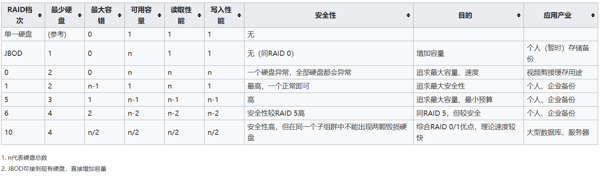</img>

- - - 
## 标准RAID
### 2.1 RAID 0
RAID 0亦称为带区集。它将两个以上的磁盘并联起来，成为一个大容量的磁盘。在存放数据时，分段后分散存储在这些磁盘中，因为读写时都可以并行处理，所以在所有的级别中，RAID 0的速度是最快的。但是RAID 0既没有冗余功能，也不具备容错能力，如果一个磁盘（物理）损坏，所有数据都会丢失，危险程度与JBOD相当。  
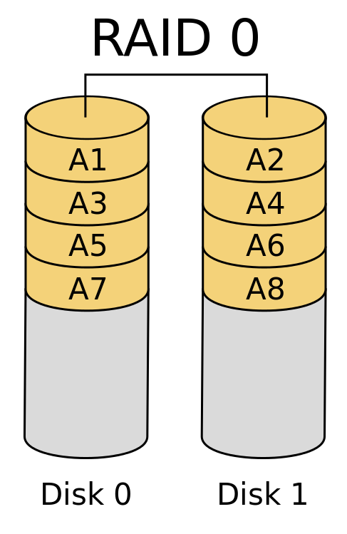</img>

### 2.2 RAID 1
两组以上的N个磁盘相互作镜像，在一些多线程操作系统中能有很好的读取速度，理论上读取速度等于硬盘数量的倍数，与RAID 0相同。另外写入速度有微小的降低。只要一个磁盘正常即可维持运作，可靠性最高。其原理为在主硬盘上存放数据的同时也在镜像硬盘上写一样的数据。当主硬盘（物理）损坏时，镜像硬盘则代替主硬盘的工作。因为有镜像硬盘做数据备份，所以RAID 1的数据安全性在所有的RAID级别上来说是最好的。但无论用多少磁盘做RAID 1，仅算一个磁盘的容量，是所有RAID中磁盘利用率最低的一个级别。

如果用两个不同大小的磁盘建RAID 1，可用空间为较小的那个磁盘，较大的磁盘多出来的空间也可以分区成一个区来使用，不会造成浪费。  
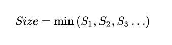</img>
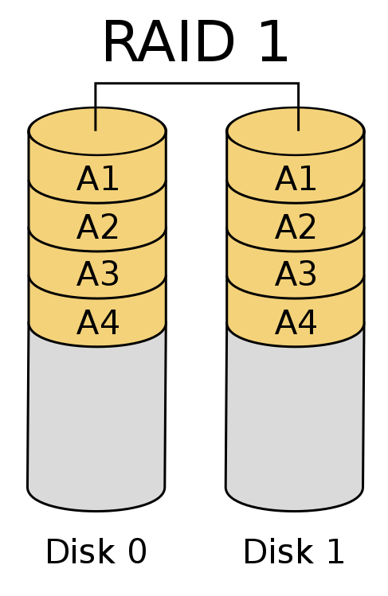</img>

### 2.3 RAID 2
这是RAID 0的改良版，以汉明码（Hamming Code）的方式将数据进行编码后分区为独立的比特，并将数据分别写入硬盘中。因为在数据中加入错误修正码（ECC，Error Correction Code），所以数据整体的容量会比原始数据大一些。

RAID 2最少要三台磁盘驱动器方能运作。  
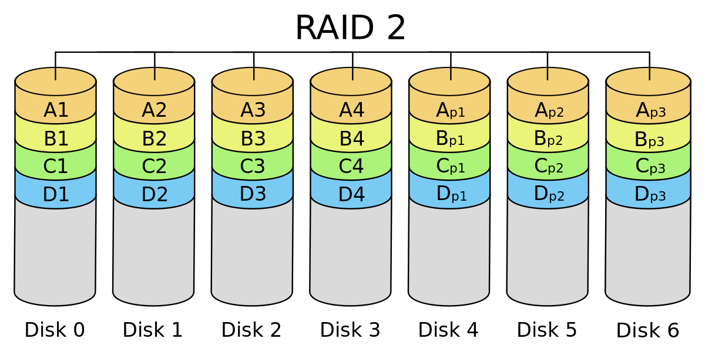</img>

### 2.4 RAID 3
采用Bit－interleaving（数据交错存储）技术，它需要通过编码再将数据比特分割后分别存在硬盘中，而将同比特检查后单独存在一个硬盘中，但由于数据内的比特分散在不同的硬盘上，因此就算要读取一小段数据资料都可能需要所有的硬盘进行工作，所以这种规格比较适于读取大量数据时使用。
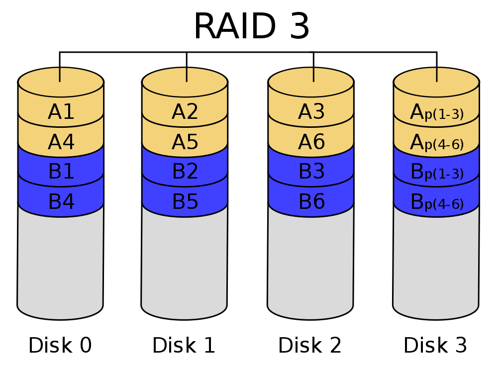</img>

### 2.5 RAID 4
它与RAID 3不同的是它在分区时是以区块为单位分别存在硬盘中，但每次的数据访问都必须从同比特检查的那个硬盘中取出对应的同比特数据进行核对，由于过于频繁的使用，所以对硬盘的损耗可能会提高。（块交织技术，Block interleaving）  
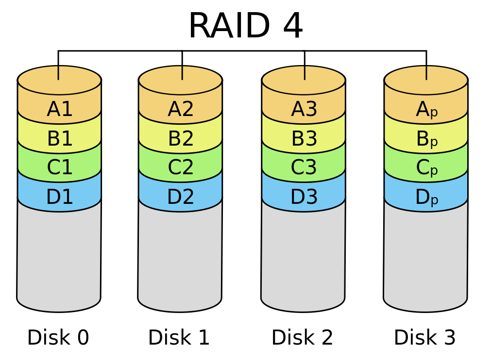</img>

### 2.6 RAID 5
RAID Level 5是一种储存性能、数据安全和存储成本兼顾的存储解决方案。它使用的是Disk Striping（硬盘分区）技术。

RAID 5至少需要三个硬盘，RAID 5不是对存储的数据进行备份，而是把数据和相对应的奇偶校验信息存储到组成RAID5的各个磁盘上，并且奇偶校验信息和相对应的数据分别存储于不同的磁盘上。当RAID5的一个磁盘数据发生损坏后，可以利用剩下的数据和相应的奇偶校验信息去恢复被损坏的数据。RAID 5可以理解为是RAID 0和RAID 1的折衷方案。RAID 5可以为系统提供数据安全保障，但保障程度要比镜像低而磁盘空间利用率要比镜像高。RAID 5具有和RAID 0相近似的数据读取速度，只是因为多了一个奇偶校验信息，写入数据的速度相对单独写入一块硬盘的速度略慢，若使用“回写缓存”可以让性能改善不少。同时由于多个数据对应一个奇偶校验信息，RAID 5的磁盘空间利用率要比RAID 1高，存储成本相对较便宜。   
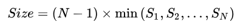</img>  
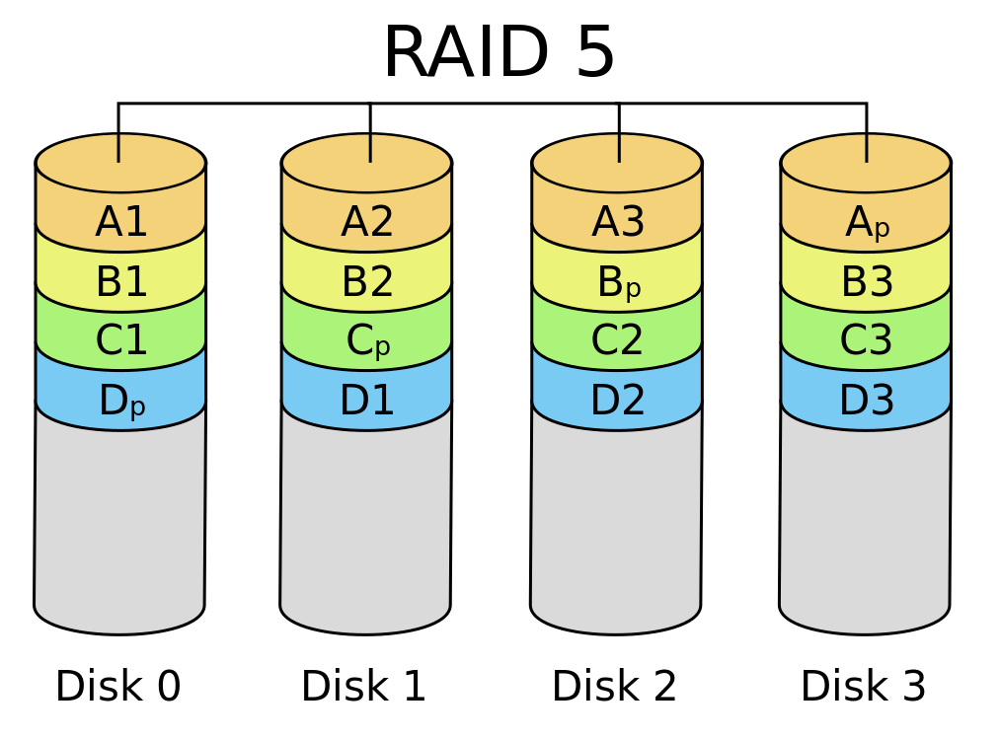</img>

### 2.7 RAID 6
与RAID 5相比，RAID 6增加第二个独立的奇偶校验信息块。两个独立的奇偶系统使用不同的算法，数据的可靠性非常高，任意两块磁盘同时失效时不会影响数据完整性。RAID 6需要分配给奇偶校验信息更大的磁盘空间和额外的校验计算，相对于RAID 5有更大的IO操作量和计算量，其“写性能”强烈取决于具体的实现方案，因此RAID 6通常不会通过软件方式来实现，而更可能通过硬件方式实现。

同一数组中最多容许两个磁盘损坏。更换新磁盘后，数据将会重新算出并写入新的磁盘中。

依照设计理论，RAID 6必须具备四个以上的磁盘才能生效。可使用的容量为硬盘总数减去2的差，乘以最小容量，公式为：  
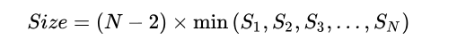</img>  
同理，数据保护区域容量则为最小容量乘以2。

RAID 6在硬件磁盘阵列卡的功能中，也是最常见的磁盘阵列档次。
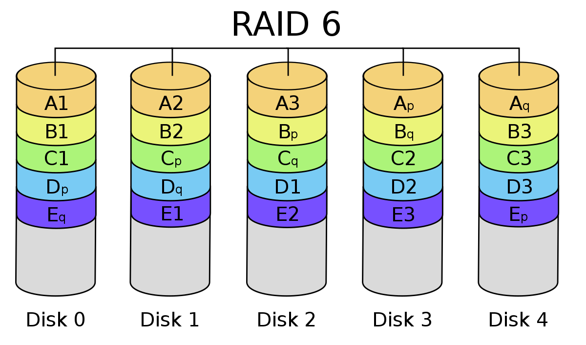</img>
- - - 
## 混合RAID
### 2.8 JBOD
JBOD（ Just a Bunch Of Disks）在分类上，JBOD并不是RAID的档次。由于并没有规范，市场上有两类主流的做法

使用单独的链接端口如SATA、USB或1394同时控制多个各别独立的硬盘，使用这种模式通常是较高阶的设备，还具备有RAID的功能，不需要依靠JBOD达到合并逻辑扇区的目的。
只是将多个硬盘空间合并成一个大的逻辑硬盘，没有错误备援机制。
数据的存放机制是由第一颗硬盘开始依序往后存放，即操作系统看到的是一个大硬盘（由许多小硬盘组成的）。但如果硬盘损毁，则该颗硬盘上的所有数据将无法救回。若第一颗硬盘损坏，通常无法作救援（因为大部分文件系统将磁盘分区表（partition table）存在磁盘前端，即第一颗），失去磁盘分区表即失去一切数据，若遭遇磁盘阵列数据或硬盘出错的状况，危险程度较RAID 0更剧。它的好处是不会像RAID，每次访问都要读写全部硬盘。但在部分的JBOD数据恢复实践中，可以恢复未损毁之硬盘上的数据。同时，因为每次读写操作只作用于单一硬盘，JBOD的传输速率与I/O表现均与单颗硬盘无异。  
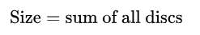</img>  
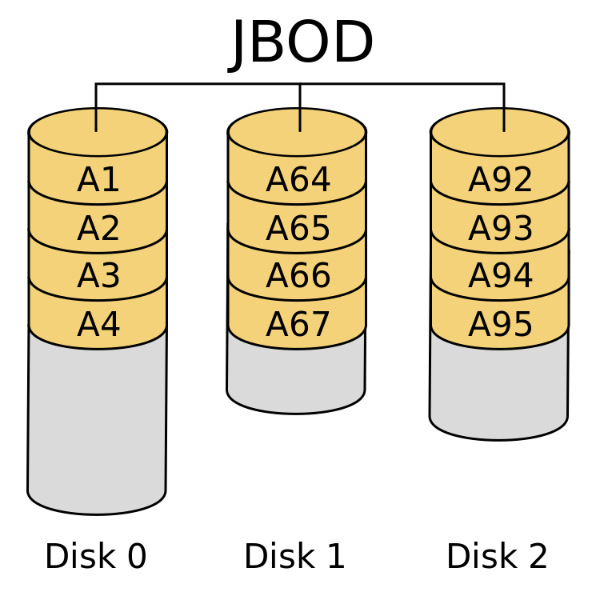</img>

### 2.9 RAID 7
RAID 7并非公开的RAID标准，而是Storage Computer Corporation的专利硬件产品名称，RAID 7是以RAID 3及RAID 4为基础所发展，但是经过强化以解决原来的一些限制。另外，在实现中使用大量的高速缓存以及用以实现异步数组管理的专用即时处理器，使得RAID 7可以同时处理大量的IO要求，所以性能甚至超越了许多其他RAID标准的实做产品。但也因为如此，在价格方面非常的高昂。

### 2.10 RAID 10/01
RAID 10是先镜射再分区数据，再将所有硬盘分为两组，视为是RAID 0的最低组合，然后将这两组各自视为RAID 1运作。

RAID 01则是跟RAID 10的程序相反，是先分区再将数据镜射到两组硬盘。它将所有的硬盘分为两组，变成RAID 1的最低组合，而将两组硬盘各自视为RAID 0运作。

当RAID 10有一个硬盘受损，其余硬盘会继续运作。RAID 01只要有一个硬盘受损，同组RAID 0的所有硬盘都会停止运作，只剩下其他组的硬盘运作，可靠性较低。如果以六个硬盘建RAID 01，镜射再用三个建RAID 0，那么坏一个硬盘便会有三个硬盘离线。因此，RAID 10远较RAID 01常用，零售主板绝大部分支持RAID 0/1/5/10，但不支持RAID 01。  
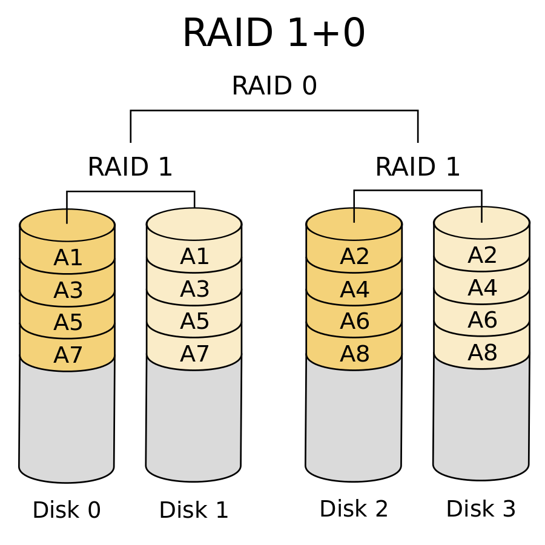</img>  
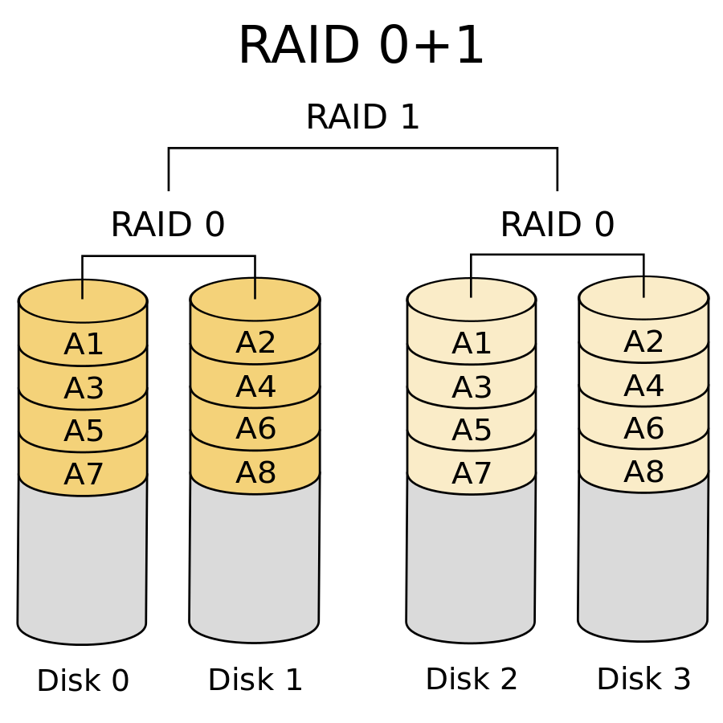</img>

### 2.11 RAID 50
RAID 5与RAID 0的组合，先作RAID 5，再作RAID 0，也就是对多组RAID 5彼此构成Stripe访问。由于RAID 50是以RAID 5为基础，而RAID 5至少需要3颗硬盘，因此要以多组RAID 5构成RAID 50，至少需要6颗硬盘。以RAID 50最小的6颗硬盘配置为例，先把6颗硬盘分为2组，每组3颗构成RAID 5，如此就得到两组RAID 5，然后再把两组RAID 5构成RAID 0。

RAID 50在底层的任一组或多组RAID 5中出现1颗硬盘损坏时，仍能维持运作，不过如果任一组RAID 5中出现2颗或2颗以上硬盘损毁，整组RAID 50就会失效。

RAID 50由于在上层把多组RAID 5构成Stripe，性能比起单纯的RAID 5高，容量利用率比RAID5要低。比如同样使用9颗硬盘，由各3颗RAID 5再组成RAID 0的RAID 50，每组RAID 5浪费一颗硬盘，利用率为(1-3/9)，RAID 5则为(1-1/9)。  
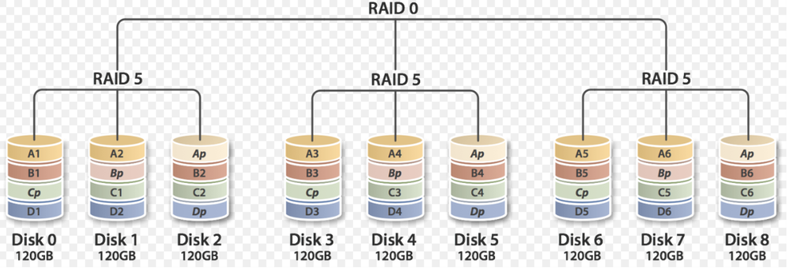</img>

### 2.12 RAID 53
它拥有一个镜射条带数组，硬盘里其中一个条带就是一个是由3组以上的RAID 5组成RAID 3硬盘阵列。

### 2.1 RAID 60
RAID 6与RAID 0的组合：先作RAID 6，再作RAID 0。换句话说，就是对两组以上的RAID 6作Stripe访问。RAID 6至少需具备4颗硬盘，所以RAID 60的最小需求是8颗硬盘。

由于底层是以RAID 6组成，所以RAID 60可以容许任一组RAID 6中损毁最多2颗硬盘，而系统仍能维持运作；不过只要底层任一组RAID 6中损毁3颗硬盘，整组RAID 60就会失效，当然这种情况的机率相当低。

比起单纯的RAID 6，RAID 60的上层透过结合多组RAID 6构成Stripe访问，因此性能较高。不过使用门槛高，而且容量利用率低是较大的问题。  
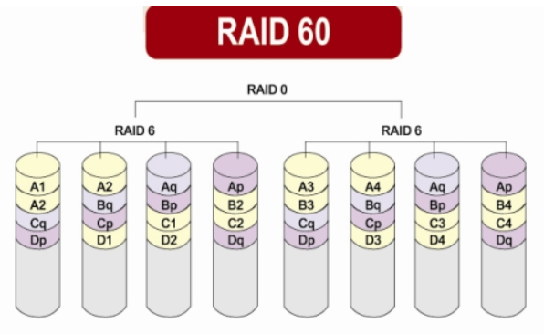</img>
- - -
## 3.RAID实现方式
根据实现模式，分为软件和硬件两种：  
**软件磁盘阵列（Software RAID）**:
主要由CPU处理数组存储作业，缺点为耗损较多CPU资源运算RAID，优点则是价格偏低。  
分类有3种：
>1. 基于主板的磁盘阵列：只需要主板支持即可（通常是芯片组内置的RAID功能，如Intel Matrix RAID），不需要任何磁盘阵列卡。若主板损坏，可能难以购买同款主板重建RAID。
>2. 硬件辅助磁盘阵列（Hardware-Assisted RAID）：需要一张基于Fake RAID的RAID卡，以及厂商所提供的驱动程序，但此类RAID卡仍然通过CPU进行运算。这款RAID较易迁移到其他计算机。RAID功能靠运行于操作系统的厂商驱动程序和CPU运算提供。
>3. 操作系统的RAID功能：Linux、FreeBSD、Windows Server等操作系统内置RAID功能，部分桌面版本的Windows也支持RAID功能。  

**硬件磁盘阵列（Hardware RAID）**:
RAID卡上内置处理器，不需要服务器的CPU运算。优点是读写性能最快，不占用服务器资源，可用于任何操作系统，也能在系统断电后，透过备份电池模块（BBU, Backup Battery Unit）以及非易失性存储器 (NVRAM)将硬盘读写日志档（Journal）包含的剩余读写作业先纪录在存储器中，等待电力供应撤消后，再由NVRAM取回日志档数据，接着再完成读写作业，将剩余读写作业安全完成以确保读写完整性。备份电池模块通常会配合数组卡的Write-Back缓存模式，借由此存储器缓存读写作业以得到更高的读写性能；但是没有备份电池模块的硬件磁盘阵列卡，切勿使用Write-Back缓存模式以免遭遇断电情形导致读写数据流失。此外，因为硬件磁盘阵列卡搭载内置处理器，所以可以与系统分离出来，对硬盘进行各种作业，还原作业的速度也比软件磁盘阵列快。缺点是其售价很高，通常只用于RAID 5和RAID 6。
- - - 
## 4.软件实现RAID步骤: 
**准备工作 ---> 创建RAID ---> 格式化与挂载 ---> 查看RAID**
- - -
### 4.0 准备工作
添加硬盘创建一些分区,注意更改分区id为lvm
```
[root@localhost ~]# ll /dev/sd*
brw-rw---- 1 root disk 8,  48 Jan 13 16:07 /dev/sdd
brw-rw---- 1 root disk 8,  64 Jan 13 16:07 /dev/sde
brw-rw---- 1 root disk 8,  80 Jan 13 16:07 /dev/sdf
brw-rw---- 1 root disk 8,  80 Jan 13 16:07 /dev/sdg
...
请大家开始自己的表演...
```
### 4.1.创建RAID
安装mdadm  
>-s  --scan  
>-S  --stop  
>-D  查看RAID详细信息  
>-C  创建RAID  + PATH(-C /dev/md0 )     
>-f   --fail  
>-r   --remove  
>-n  RAID成员的数量  
>-x  热备磁盘的数量   
>-l  RAID类型  
>-l  5(RAID5)
```
[root@localhost ~]# yum -y install mdadm
[root@localhost ~]# mdadm -C /dev/md0 -l5 -n3 -x1 /dev/sd{d,e,f,g}
mdadm: array /dev/md0 started.
```

### 4.2.格式化与挂载
```
[root@localhost ~]# mkfs.xfs /dev/md0
[root@localhost ~]# mkdir /mnt/raid5
[root@localhost ~]# mount /dev/md0 /mnt/raid5
[root@localhost ~]# cp -rf /etc /mnt/raid5/etc1
```

### 4.3.查看RAID
```
[root@localhost d2]# # mdadm -D /dev/md0
/dev/md0:
        Version : 1.2
  Creation Time : Mon Jan 13 16:28:47 2014
     Raid Level : raid5
     Array Size : 2095104 (2046.34 MiB 2145.39 MB)
  Used Dev Size : 1047552 (1023.17 MiB 1072.69 MB)
   Raid Devices : 3
  Total Devices : 4
    Persistence : Superblock is persistent

    Update Time : Mon Jan 13 16:34:51 2014
          State : clean 
 Active Devices : 3
Working Devices : 4
 Failed Devices : 0
  Spare Devices : 1

         Layout : left-symmetric
     Chunk Size : 512K
    Number   Major   Minor   RaidDevice State
       0       8       48        0      active sync   /dev/sdd
       1       8       64        1      active sync   /dev/sde
       4       8       80        2      active sync   /dev/sdf

       3       8       96        -      spare   /dev/sdg
```

### 4.4.设置RAID开机生效
xfs_growfs命令用于重新识别xfs文件系统，格式为“**xfs_growfs [LV名称]**”
```
[root@localhost ~]# mdadm -D -s
ARRAY /dev/md0 metadata=1.2 name=sxl1.com:0 UUID=c6761621:8878498f:f5be209e
[root@localhost ~]# mdadm -D -s > /etc/mdadm.conf
```
- - - 

```
创建一个5G的RAID0的分区myraid，由5个1G的分区以RAID0的方式组成
[root@localhost ~]# mdadm -C /dev/md/myraid -l0 -n5 /dev/sdc{1,5,6} /dev/sdd{1,5}

创建一个RAID1的阵列，大小为1G，由5个1G构成
mdadm -C /dev/md1 -l1 -n4 -x1 /dev/sdc{1,5,6} /dev/sdd{1,5}

停用RAID阵列
mdadm --stop /dev/md127 

```

