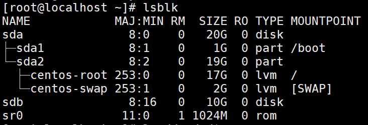

# 十二.软件管理

## 1.常用软件包封装类型

<table>
    <tr>
        <td>类型</td>
        <td>说明</td>
    </tr>
    <tr>
        <td>rpm软件包</td>
        <td>拓展名为".rpm"  </td>
    </tr>
    <tr>
        <td>deb软件包</td>
        <td>拓展名为".deb" </td>
    </tr>
    <tr>
        <td>源代码软件包</td>
        <td>一般为“.tar.gz”、“.tar.bz2”等格式的压缩包,包含程序的原始代码</td>
    </tr>
    <tr>
        <td>附带安装程序的软件包</td>
        <td>在压缩包内提供install.sh、setup等安装程序
        或以“.bin”格式的单个执行文件提供</td>
    </tr>
    <tr>
        <td>绿色免安装的软件包</td>
        <td>在压缩包内提供已编译好的执行程序文件,
        解开压缩包后的文件即可直接使用  </td>
    </tr>
</table> 

## 2.Linux下RPM和DPKG
**RPM(Red Hat Package Manager)**：
最早由Red Hat研制，现在也由开源社区开发。RPM通常随附于Linux发行版，但也有单独将RPM作为应用软件发行的发行版（例如Gentoo）。RPM仅适用于安装用RPM来打包的软件，目前是GNU/Linux下软件包资源最丰富的软件包类型之一。后来实在是好用，因此很多 distributions 就使用这个机制来作为软件安装的管理方式。包拪 Fedora, CentOS, SuSE 等等知名的开发商都在使用 

**dpkg(Debian Package)**：
它被伊恩·默多克创建于1993年。dpkg与RPM十分相似，同样被用于安装、卸载和供给和.deb软件包相关的信息。只要是衍生于Debian 的其他 Linux distributions 大多使用 dpkg 这个机制来管理软件的， 包拪 B2D, Ubuntu 等等。  
dpkg本身是一个底层的工具。上层的工具，像是APT，被用于从远程获取软件包以及处理复杂的软件包关系。 

<table>
    <tr>
        <td>发行版代表</td>
        <td>软件管理机制</td>
        <td>使用指令</td>
        <td>在线升级机制</td>
    </tr>
    <tr>
        <td>Red Hat/Fedora</td>
        <td>RPM </td>
        <td>rpm,rpmbuild</td>
        <td>YUM(yum)</td>
    </tr>
    <tr>
        <td>Debian/Ubuntu</td>
        <td>DPKG </td>
        <td>dpkg</td>
        <td>APT(apy-get)</td>
    </tr>
</table> 

## 3.软件包的管理
软件包的管理分为安装，查询，卸载，软件类型分为源码包和二进制包

### 3.1 RPM包获取途径
主要获得RPM包途径：
1. RedHat光盘或官方网站 [ftp://ftp.redhat.com](<ftp://ftp.redhat.com>)
2. [rpmfind.net](https://rpmfind.net/)
3. 相应软件官方网站如 [http://www.mysql.com](<http://www.mysql.com>)

### 3.2 认识RPM包
```
ntfs-3g-2011.4.12-5.el5.x86_64.rpm                        套件名
ntfs-3g-2011.4.12-5.el6.i686.rpm                          套件名
ntfs-3g-2011.4.12-5.el6.x86_64.rpm                        套件名
yum-rhn-plugin-0.9.1-40.el6.noarch.rpm                    套件名
yum-utils-1.1.30-14.el6.noarch.rpm                        套件名
mysql-community-common-5.7.12-1.el7.i686.rpm
mysql-community-common-5.7.12-1.el7.x86_64.rpm
mysql-community-embedded-devel-5.7.12-1.el6.x86_64.rpm
php-5.6.20-1.fc23.x86_64.rpm
php-5.6.20-1.fc23.ppc64p7.rpm       

软件包名     版本号(Version)     发布版本(Release)         系统平台
ntfs-3g       2011.4.12          5.el6                      i386
ntfs-3g       2011.4.12          5.el6                      x86_64
yum-utils     1.1.30             14.el6                     noarch
php           5.6.20             1.fc23                     x86_64
php           5.6.20             1.fc23                     ppc64p7

//查看电脑架构
[root@localhost ~]# uname -m
x86_64

//查看系统版本信息
[root@localhost ~]# cat /etc/CentOS-release 
CentOS Linux release 7.2.1511 (Core)
```
### 3.3 RPM包管理常用命令
使用命令为 **rpm [选项]**
1. 安装  rpm -ivh xxx.rpm 注意:RPM包安装信息存储到本地RPM数据库中
> i:安装  
> v:显示过程  
> h:以#显示安装进度  
```
安装wget
[root@localhost ~]# rpm -ivh wget-1.14-10.el7_0.1.x86_64.rpm
```
2. 升级 rpm -Uvh
> -Uvh  如果老版本存在则升级为新版本，若老版本不存在直接安装新版本  
> -F 升级的前提是必须已经安装老版本软件
```
[root@localhost ~]# rpm -Uvh ftp://rpmfind.net/linux/centos/7.3.1611/os/x86_64/Packages/wget-1.14-13.el7.x86_64.rpm  
```
3. 卸载 -e
```
[root@localhost ~]# rpm -e wget
```
4. 查看 rpm -q
> -qi 查看已安装包信息  
> -qc 查看已安装包配置  
> -qd 查看已安装包文档  
> -ql list 列出安装文件  
> -qf ：rpm -qf /sbin/ifconfig  查询文件由那个软件包提供  
> -qa 列出所有已经安装的软件包  
> 未安装包查询以上增加p 如qpi、qpd、qpc、qpl
```
(从本地的rpm数据库)
[root@localhost ~]# rpm -q ntfs-3g              //查询指定包是否安装
[root@localhost ~]# rpm -qa |grep ntfs
[root@localhost ~]# rpm -ql ntfs-3g              //查询ntfs-3g安装的文件     
[root@localhost ~]# rpm -qf /usr/bin/ntfs-3g          //查询该文件属于哪个rpm包
[root@localhost ~]# rpm -qi ntfs-3g              //查询包的information
[root@localhost ~]# rpm -qc ntfs-3g                //查询某个包安装的配置文件
[root@localhost ~]# rpm -qd vsftpd              //查安装的帮助文档

(从rpm套件中查询)
扩展知识： 针对没有安装的包，直接从套件中查询
[root@localhost ~]# rpm -e ntfs-3g
[root@localhost ~]# rpm -qip ntfs-3g-2011.4.12-5.el6.x86_64.rpm            
[root@localhost ~]# rpm -qlp ntfs-3g-2011.4.12-5.el6.x86_64.rpm
[root@localhost ~]# rpm -qcp ntfs-3g-2011.4.12-5.el6.x86_64.rpm
[root@localhost ~]# rpm -qdp ntfs-3g-2011.4.12-5.el6.x86_64.rpm
```
5. 额外选项：
* --nomd5        //不检验软件包的签名
* --force        //强制安装软件包
* --nodeps       //忽略依赖关系


### 3.4 RPM包的局限
1. 很难解决包依赖关系
2. 如果某个文件没有，很难知道它由哪个rpm包提供

## 4.YUM包管理
YUM本质上也是RPM包管理，方便解决了包之间的依赖关系，但是一般仅使用yum安装，而不使用yum卸载。CentOS7 安装完毕就会默认配置yum源文件。  
**配置文件路径为/etc/yum.repos.d/,**  
**后缀名为.repo**

### 4.1 自定义配置本地光盘yum源
**注意**:若需要光盘永久挂载，请在/etc/fstab文件中加一行：  
```
/dev/sr0 /mnt/cdrom  iso9660 defaults 0 0
```
开始:
```
1) 先备份系统自动配置的yum源文件
[root@localhost ~]# mkdir bak_repo
[root@localhost ~]# mv *.repo bak_repo/
 
2) 自己编写yum源文件,格式如下:
[CentOS7]---唯一标识
name=local dvd ---描述信息
baseurl=file:///mnt/cdrom ---安装软件包来源
      #file代表本地 file://
      #http://
      #ftp://
gpgcheck=0 ---不做校验
enabled=1  ---启用yum源

3) 清理并使配置生效
[root@localhost ~]# yum clean all
[root@localhost ~]# yum repolist
```
### 4.2 配置使用国内互联网yum源
国内CentOS的几个源:
* sohu源:<http://mirrors.sohu.com/>
* 163源:<http://mirrors.163.com/>
* 阿里源:<https://opsx.alibaba.com/mirror>

### 4.3 配置使用扩展yum源
若发现以上两种都没有我们想要的软件，就需要使用拓展的yum源了，一般常用的有EPEL和remi
* **EPEL** (Extra Packages for Enterprise Linux):
```
1)安装
[root@localhost ~]# yum install -y http://mirrors.sohu.com/centos/7.3.1611/extras/x86_64/Packages/epel-release-7-9.noarch.rpm
2)查看配置文件路径
[root@localhost ~]# rpm -ql epel-release
```
* **remi**:注意,remi源默认没启用
```
1)安装
[root@localhost ~]# rpm -ivh https://mirrors.tuna.tsinghua.edu.cn/remi/enterprise/remi-release-7.rpm
#remi 源默认没启用  
[root@localhost ~]# yum [参数] --enablerepo=remi 
```

### 4.4 yum的使用
#### 4.4.1.列出 list
    yum list all | grep key  or |grep ^key查询以key开头的
    yum list httpd
    
    yum group list :列出包组
#### 4.4.2.搜素 search
    yum search httpd

#### 4.4.3.info 信息
    yum info httpd 

#### 4.4.4.install 安装
    yum install -y httpd  #安装单个软件包

    yum group install "带 GUI 的服务器"  --安装图形化
    systemctl set-default graphical.target --设置启动级别

    #从指定的yum源安装软件vsftpd
    yum install vsftpd --enablerepo=remi

#### 4.4.5.更新 update
    生产：最小化安装系统，更换为163的镜像源，执行yum update -y 
    升级单个软件包：
    yum update httpd -y 

#### 4.4.6.卸载 
    remove/erase 

#### 4.4.7.reinstall 重新安装
    yum reinstall httpd -y

#### 4.4.8.clean all 清除所有缓存

#### 4.4.9.makecache 生成缓存

#### 4.4.10.查看可用仓库  repolist

#### 4.4.11.provides 查询指定的软件属于那个包
    yum provides */ifconfig

- - -
</img>

