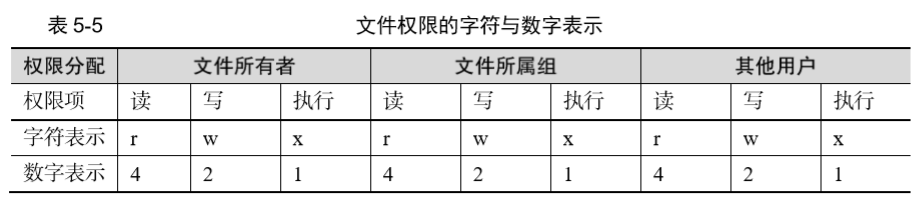
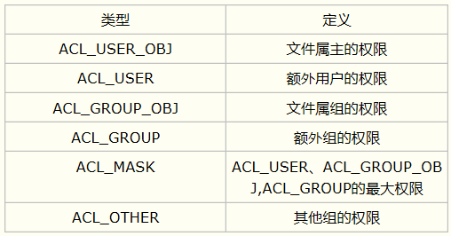
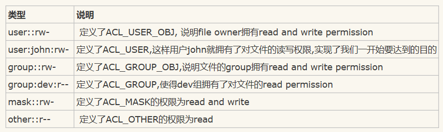

# 四.Linux-文件权限管理

## 1.简介
<font color=red size=5 face="黑体" >自主访问控制(Discretionary Access Control, DAC)</font>是指对象(比如程序、文件、进程)的拥有者可以任意修改或者授予此对象相应的权限。Linux的<font color=red size=5 face="黑体" >UGO(User, Group, Other)</font>和<font color=red size=5 face="黑体" >ACL(Access Control List)</font>权限管理方式就是典型的自主访问控制。UGO将权限信息存储在节点的权限中，ACL将权限位信息存储在节点的扩展属性中。  

Linux中一切皆文件，各种文件类型在linux中使用不同的字符加以区分，常见字符如下: 
<table>
<tr>
<td bgcolor=lightgray>

* -：普通文件
* d：目录文件
* l：链接文件
* b：块设备文件
* c：字符设备文件
* p：管道文件
</tb>
</tr>
</table>

在 Linux 系统中，每个文件都有所属的所有者和所有组，并且规定了文件的所有者、所有组以及其他人对文件所拥有的可读（r）、可写（w）、可执行（x）等权限。  

对于一般文件来说，权限比较容易理解：“可读”表示能够读取文件的实际内容；“可写”表示能够编辑、新增、修改、删除文件的实际内容；“可执行”则表示能够运行一个脚本程序。  

对目录文件来说，“可读”表 示能够读取目录内的文件列表；“可写”表示能够在目录内新增、删除、重命名文件；而“可 执行”则表示能够进入该目录

文件的读、写、执行权限可以简写为 rwx，亦可分别用数字 4、2、1 来表示，文件所有 者，所属组及其他用户权限之间无关联。如下图:  

  

举例：文件的权限就是 rwxrw-r--，数字法表示即为 764，

## 2.基本权限修改(UGO)

> * 属主：       u  
> * 属组：       g
> * 其他人:      o
> * 所有人：     a

1. ### 设置权限  
#### chown
修改文件所有者和组别 用法： chown [选项] user[:group] file
>* -R 递归的修改目录及其下面内容的所有权
>* -c 详尽的描述每个文件实际改变了那些所有权
>* -f 不打印文件所有权不能修改的报错信息
>* -v 详尽地描述对每个 file 所执行的操作(或者无操作)

示例:   
1.chown d1.demo 1.txt   //修改主，属组  
2.chown d1      2.md    //修改主组
3.chown .demo   3.jpg   //修改属组

#### chgrp
只修改文件属组

#### chmod
改变文件的访问权限，用法 chmod [选项] mode file：其中mode可以是三组权限对应的十进制数值，对象为u,g,o,a;赋值符为+,-,=;权限类型分为r,w,x;
>* -R 递归修改
>* -v 详细说明权限的变化
>* -c 只有在文件的权限确实改变时才进行详细的说明
>* -f 不输出权限不能改变的文件的错误信息

示例:   
1.chmod a-x 1.txt   //去掉1.txt的可执行权限  
2.chmod o+w 2.md    //对于其它人，给2.md加上写权限  
3.chmod a=- 3.jpg   //所有人对于3.jpg都没有权限  
4.chmod g=rwx 3.jpg   //属组成员对于3.jpg有读写运行权限  
5.chmod ug=rw,o=r file1     //属主属组等于读写，其他人只读  
6.chmod 644 file1     //自己读写权限，其他人只读

#### 综合示例
公司开发部门的访问目录需要设置权限,有以下两个要求：  
1. root用户和dev组用户可以读，写，执行；
2. 其它用户没有任何权限  
```
[root@localhost ~]# groupadd dev  
[root@localhost ~]# useradd dev01 -G dev 
[root@localhost ~]# useradd dev02 -G dev  
[root@localhost ~]# mkdir /home/dev  
[root@localhost ~]# chgrp dev /home/dev  
[root@localhost ~]# chmod 770 /home/dev  
[root@localhost ~]# ll -d /home/dev/  
drwxrwx---. 2 root dev 4096 5月  11 14:26 /home/dev/
```

## 3.基本权限修改(ACL)
UGO权限管理方式只能对属主、同组用户和其他组用户进行权限管理，很难对每个用户或用户组进行权限管理。ACL就是为了这种局限性而生的。  
ACL(Access Control List, 访问控制列表)，它是对UGO权限管理的方式进行了扩展、可以对任意的用户/组分配读、写和执行权限。   

其常用的命令有<font color=red size=5 face="黑体" >getfacl</font>和<font color=red size=5 face="黑体" >setfacl</font>,<font color=red size=5 face="黑体" >chacl</font>。 

ACL是由一系列的Access Entry所组成的，每一条Access Entry定义了特定的类别可以对文件拥有的操作权限。
Access Entry有三个组成部分：
- Entry tag type
- qualifier (optional)
- permission。-      

几种类型：  
</img>

下面我们就用getfacl命令来查看一个定义好了的ACL文件：
```
[root@localhost ~]# getfacl ./test.txt
#file: test.txt
#owner: root
#group: admin
user::rw-
user:john:rw-
group::rw-
group:dev:r--
mask::rw-
other::r--
```
前面三个以#开头的定义了文件名，file owner和group。这些信息没有太大的作用，可以用--omit-header来省略掉。  
</img>

设置ACL的命令是setfacl，-m选项表示修改acl规则，使用方式是setfacl  -m {u|g}:{user|group}:rwx;  
u表示设置ACL_USER的权限，g表示修改ACL_GROUP的权限

-m 修改

-x 删除
 
-b 删除所有  


1. 普通使用
2. MASK
3. Default ACL（继承）上面都是Access ACL，也就是对文件而言。Default ACL是指对于一个目录进行Default ACL设置，并且在此目录下建立的文件都将继承此目录的ACL。  

### ＝ACL基本用法＝  
```
设置：
[root@localhost ~]# getfacl /home/test.txt  
[root@localhost ~]# setfacl -m u:alice:rw /home/test.txt       //增加用户alice权限  
[root@localhost ~]# setfacl -m u:jack:- /home/test.txt         //增加用户jack权限  
[root@localhost ~]# setfacl -m o::rw /home/test.txt  

查看/删除：  
[root@localhost ~]# setfacl -m g:hr:r /home/test.txt  
[root@localhost ~]# setfacl -x g:hr /home/test.txt             //删除组hr的acl权限  
[root@localhost ~]# setfacl -b /home/test.txt                  //删除所有acl权限  

特殊用法:
[root@localhost ~]# getfacl file1 |setfacl  --set-file=- file2    //复制file1的ACL权限给file2

继承：
[root@localhost ~]# setfacl -m u:alice:rwx /home

步骤二： 赋予alice对以后在/home下新建的文件有读、写、执行权限 （使alice的权限继承）
[root@localhost ~]# setfacl -m d:u:alice:rwx /home
```
>如果一个文件后面有+标记，我们都需要用getfacl来确认它的permission，以免发生混淆  


>chacl是用来改变文件和目录的Access ACL and Default ACL  
chacl -B。它可以彻底删除文件或者目录的ACL属性(包括Default ACL)，比如你即使用了setfacl -x删除了所有文件的ACL属性，那个+号还是会出现在文件的末尾，所以正确的删除方法应该是用chacl -B.  

>用cp来复制文件的时候我们现在可以加上-p选项。这样在拷贝文件的时候也将拷贝文件的ACL属性，对于不能拷贝的ACL属性将给出警告。 

>mv命令将会默认地移动文件的ACL属性，同样如果操作不允许的情况下会给出警告.  


## 4.高级权限（suid，sgid，sbit）

在复杂多变的生产环境中，单纯设置文件的 rwx 权限无法满足我们对安全和灵活性的需求，因此便有了 <font color=red size=5 face="黑体" >SUID、SGID 与 SBIT </font>的特殊权限位。这是一种对文件权限进行设置的特殊功能，可以与一般权限同时使用，以弥补一般权限不能实现的功能。

### SUID
SUID 是一种对二进制程序进行设置的特殊权限，可以让二进制程序的执行者临时拥有 属主的权限（仅对拥有执行权限的二进制程序有效）。  
查看 passwd 命令属性时发现所有者的权限由 rwx 变成了 rws，其中 x 改变成 s 就意味着该文件被赋予了 SUID 权限。如果原先权限位上没有 x 执行权限，那么被赋予特殊权限后将变成大写的 S。

### SGID
SGID 主要实现如下两种功能  
> 1. 让执行者临时拥有属组的权限（对拥有执行权限的二进制程序进行设置）； 
> 2. 在某个目录中创建的文件自动继承该目录的用户组（只可以对目录进行设置）。   

SGID 的第一种功能是参考 SUID 而设计的，不同点在于执行程序的用户获取的不再是文 件所有者的临时权限，而是获取到文件所属组的权限.

### SBIT(Sticky Bit)
SBIT 特殊权限位可确保用户只能删除自己的文件，而不能删除其他用户的文件。 举例，当对某个目录设置了 SBIT 粘滞位权限后，那么该目录中的文件就只能被其所有者执行删除操作了.与前面所讲的 SUID 和 SGID 权限显示方法不同，当目录被设置 SBIT 特殊权限位后，文件的其他人权限部分的 x 执行权限就会被替换成 t 或者 T，原本有 x 执行权限则会写成 t，原s本没有 x 执行权限则会被写成 T。 

### 使用
高级权限的类型 :
1. suid　　　4  
2. sgid　　　2  
3. sbit　　　1   粘滞位

设置特殊权限  
a、字符
> chmod u+s file  
> chmod g+s dir  
> chmod o+t dir

b、数字
> chmod <font color=red>4</font>777 file  
> chmod <font color=red>7</font>777 file  
> chmod <font color=red>2</font>770 dir  
> chmod <font color=red>3</font>770 dir

## 5.文件的隐藏属性
Linux 系统中的文件除了具备一般权限和特殊权限之外，还有一种隐藏权限，即被隐藏起 来的权限，默认情况下不能直接被用户发觉

### chattr
本命令用于设置文件的隐藏权限，用法: chattr [参数] file. 若要给文件添加某个隐藏功能，命令后追加“ + 参数”，若要从文件中移除某个隐藏功能，追加“ - 参数”。  
>* i: 无法对文件修改；若是目录，则仅能修改其中子文件内容，不能新建或删除文件
>* a: 仅允许补充（追加）内容，无法覆盖/删除内容（Append Only)
>* S: 文件内容在变更后立即同步到硬盘(sync)
>* s: 彻底从硬盘中删除，不可恢复(用0填充源文件所在硬盘区域)
>* A: 不再修改这个文件或目录的最后访问时间(atime)
>* b: 不再修改文件或者目录的存取时间
>* D: 检查压缩文件中的错误
>* d: 使用dump命令备份时忽略本文件/目录
>* c: 默认将文件或者目录进行压缩
>* u: 当删除该文件后依然保留其在硬盘中的数据，方便日后恢复
>* t: 让文件系统支持尾部合并
>* X: 可以直接访问压缩文件中的内容  
  

### lsattr
本命令用于显示文件的隐藏权限，用法: lsattr [参数] file.  在linux系统中，文件的隐藏权限必须使用lsattr命令来查看，ls之类的命令看不出端倪。


