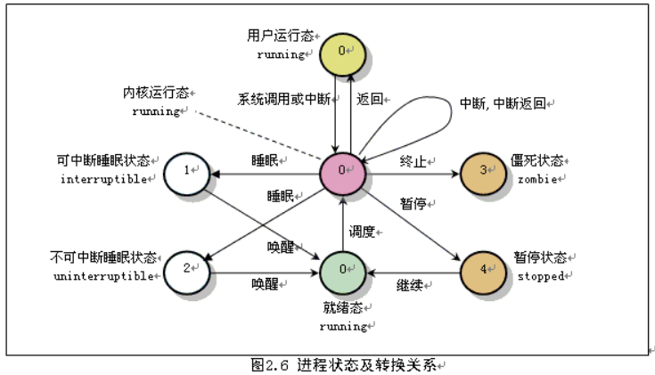
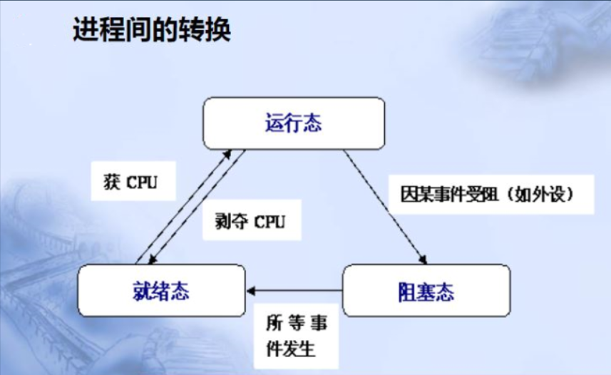

# Linux-进程管理

## 1.简介
在linux系统中，进程是已启动的可执行程序的运行实例，进程有以下组成部分：
• 已分配内存的地址空间；
• 安全属性，包括所有权凭据和特权；
• 程序代码的一个或多个执行线程；
• 进程状态。   

>程序:静态，二进制文件。 /bin/date,/user/sbin/httpd,/usr/sbin/sshd.  
>进程:是程序运行的过程， 动态，有生命周期及运行状态。

### 1.1 程序和进程的区别
1. 进程和程序并不是一一对应的关系，相同的程序运行在不同的数据集上就是不同的进程
2. 程序是静态的，它只是一组指令的集合，不具有任何的运行意义。而进程是程序运行的动态过程
3. 进程还具有并发性和交往性，而程序却是封闭的

### 1.2 进程和线程的区别
1. 一个进程可以拥有多个线程，而一个线程同时只能被一个进程所拥有
2. 线程不能单独执行，但是每一个线程都有程序的入口、执行序列以及程序出口，它必须组成进程才能被执行

### 1.3 进程的生命周期,父子关系
</img>
父进程复制自己的地址空间（fork）创建一个新的（子）进程结构。每个新进程分配一个唯一的进程 ID （PID），满足跟踪安全性之需。PID 和 父进程 ID （PPID）是子进程环境的元素，任何进程都可以创建子进程.  
所有进程都是第一个系统进程的后代:
>Centos5/6:  init  
>Centos7:    systemd

#### 父子进程的关系
>* 子进程是由一个进程所产生的进程，产生这个子进程的进程称为父进程.   
>* 在linux系统中，使用系统调用fork创建进程。fork复制的内容包括父进程的数据和堆栈段以及父进程的进程环境。  
>* 父进程终止子进程自然终止。
>* 子进程继承父进程的安全性身份、过去和当前的文件描述符、端口和资源特权、环境变量，以及程序代码。随后，子进程可能exec自己的程序代码。通常，父进程在子进程运行期间处于睡眠（sleeping）状态。当子进程完成时发出（exit）信号请求，在退出时，子进程已经关闭或丢弃了其资源环境，剩余的部分称之为僵停（僵尸Zombie）。父进程在子进程退出时收到信号而被唤醒，清理剩余的结构，然后继续执行其自己的程序代码。

### 1.4 前台进程和后台进程
#### 前台进程:
<table>
<tr>
<td bgcolor=cyan>
在 shell 提示处理打入命令后，创建一个子进程，运行命令， Shell 等待命令退出，然后返回到对用户给出提示符。这条命令与 Shell 异步运行，即在前台运行，用户在它完成之前不能执行别一个命令 。
</td>
</tr>
</table>

#### 后台进程:
<table>
<tr>
<td bgcolor=cyan>
在 Shell 提示处打入命令，若后随一个 &， Shell 创建子进程运行此命令，但不等待命令退出，而直接返回到对用户给出提示。这条命令与 Shell 同步运行，即在后台运行。“后台进程必须是非交互式的” 。
</td>
</tr>
</table>

### 1.5 进程状态
</img>
* 运行状态（TASK_RUNNING）  
当进程正在被CPU执行，或已经准备就绪随时可由调度程序执行，则称该进程为处于运行状态（running）。进程可以在内核态运行，也可以在用户态运行。当系统资源已经可用时，进程就被唤醒而进入准备运行状态，该状态称为就绪态。这些状态（图中中间一列）在内核中表示方法相同，都被成为处于TASK_RUNNING状态。  
* 可中断睡眠状态（TASK_INTERRUPTIBLE）  
当进程处于可中断等待状态时，系统不会调度该进程执行。当系统产生一个中断或者释放了进程正在等待的资源，或者进程收到一个信号，都可以唤醒进程转换到就绪状态（运行状态）。  
* 不可中断睡眠状态（TASK_UNINTERRUPTIBLE）  
与可中断睡眠状态类似。但处于该状态的进程只有被使用wake_up()函数明确唤醒时才能转换到可运行的就绪状态。  
* 暂停状态（TASK_STOPPED）  
当进程收到信号SIGSTOP、SIGTSTP、SIGTTIN或SIGTTOU时就会进入暂停状态。可向其发送SIGCONT信号让进程转换到可运行状态。在Linux 0.11中，还未实现对该状态的转换处理。处于该状态的进程将被作为进程终止来处理。  
* 僵死状态（TASK_ZOMBIE）  
当进程已停止运行，但其父进程还没有询问其状态时，则称该进程处于僵死状态。  

</img>
</img>
</img>

## 2.查看进程
1. ### ps
此命令用于显示当前进程(process)的状态，使用方法 ps 选项
>* -A  列出所有的进程
>* -a  列出所有用户的进程
>* -u  显示用户名和启动时间
>* -x  显示没有终端控制的进程  
>* -e  显示所有进程，包括没有控制终端的进程
>* -l  长格式显示
>* -w  宽行显示，可以使用多个w进行加宽显示
>* ...
#### 常用
>* ps -au 显示较详细的信息
>* ps -aux 显示所有包含其它使用者的进程
>* ps aux|more -6 6行显示，空格继续
>* ps 查看隶属自己的进程 
>* ps -u or -l 查看隶属于自己进程详细信息 
>* ps -le or -aux 查看所有用户执行的进程的详细信息 
>* ps -aux --sort pid 可按进程执行的时间、 PID、 UID 等对进程进行排序 
>* ps -ef
>* ps axo user,pid,ppid,%mem,command | grep init   自定义显示字段
>* 

au(x)的输出格式:  
<table>
<tr>
<td bgcolor=lightgray>
USER PID %CPU %MEM VSZ RSS TTY STAT START TIME COMMAND  
</td>
</tr>
</table>

* USER ：进程拥有者
* PID ：pid
* %CPU ：cpu占用率
* %MEM ：内存占用率
* VSZ ：虚拟内存占用
* RSS ：占用内存大小
* TTY ：虚拟终端编号
* STAT ：该进程的状态：
> * D：不可中断的静止
> * R：正在执行中 。
> * S：静止状态 
> * T：暂停执行 
> * Z：不存在但暂时无法消除 
> * W：没有足够的记忆体分页可分配 
> * <: 高优先序的进程 
> * N: 低优先序的行程 
> * L：有记忆体分页分配并锁在记忆体内 
> * Ss s进程的父进程
> * S< <优先级较高的进程
> * SN N优先级较低的进程
> * R+ +表示是前台的进程组
> * Sl 以线程的方式运行
* START ：进程开始时间
* TIME ：执行的时间
* COMMAND ：所执行的命令  
  
#### 拓展:ps aux与ps -ef区别  
这要追溯到Unix系统中的两种风格，System Ｖ风格和BSD 风格，ps aux最初用到Unix Style中，而ps -ef被用在System V Style中，两者输出略有不同。现在的大部分Linux系统都是可以同时使用这两种方式。

2. ### top
此命令用于实时显示进程(process)的动态，使用方法 top [-] [d delay] [n]
>* -d  改变显示的更新速度，或是在交谈式指令列按s
>* -n  更新的次数，完成后退出
#### 常用
>* top 显示进程信息
>* top -n 2 // 更新两次后终止更新显示
>* top -d 3 // 更新周期3秒

3. ### kill
此命令用于删除执行中的程序或者工作，使用方法 kill [-参数] [进程PID]
>* kill -l
>* 编号 信号名
>* 1   SIGHUP  重新加载配置
>* 2   SIGINT  键盘中断^C
>* 3   SIGQUIT 键盘退出 
>* 9   SIGKILL 强制终止 
>* 15  SIGTERM 终止，正常结束 此为缺省信号
>* 18  SIGCONT 继续
>* 19  SIGSTOP 停止
>* 20  SIGTSTP 暂停^Z
#### 常用
>* kill -1 9160 //向进程pid=9160发送重启信号
>* kill 9160 //发送停止信号

4. ### pstree,w,killall,pkill
#### w
查看当前系统信息  

w [user] 查看user用户信息

#### pkill
一般用于踢出某一登录用户
>* pkill -t pts/2                //终止pts/2上所有进程
>* pkill -9 -t pts/2            //终止pts/2上所有进程  并结束该pts/2
>* pkill -u yln              //慎用，

## Linux进程优先级
### Linux 进程调度及多任务
每个CPU（或CPU核心）在一个时间点上只能处理一个进程，通过时间片技术，Linux实际能够运行的进程（和线程数）可以超出实际可用的CPU及核心数量。Linux内核进程调度程序将多个进程在CPU核心上快速切换，从而给用户多个进程在同时运行的印象。

### 相对优先级 nice
由于不是每个进程都与其他进程同样重要，可告知进程调度程序为不同的进程使用不同的调度策略。常规系统上运行的大多数进程所使用的调度策略为 SCHED_OTHER (也称为SCHED_NORMAL)，但还有其它一些调度策略用于不同的目的。  

SCHED_OTHER 调度策略运行的进程的相对优先级称为进程的 nice 值，可以有40种不同级别的nice值。
</img>
* nice值越高：表示优先级越低，例如+19，该进程容易将CPU 使用量让给其他进程。
* nice值越低：表示优先级越高，例如-20，该进程更不倾向于让出CPU。

### 1.查看进程的nice级别
1. 使用top查看nice级别  
NI:  实际nice级别  
PR: 将nice级别显示为映射到更大优先级队列，-20映射到0，+19映射到39

3. 使用ps查看nice级别
> ps axo pid,command,nice  --sort=-nice  
> ps axo pid,command,nice,cls  --sort=-nice

TS 表示该进程使用的调度策略为SCHED_OTHER

### 2.启动具有不同nice级别的进程
启动进程时，通常会继承父进程的 nice级别，默认为0。  
例如： nice --5 command 

> nice -n -5 sleep 6000 &   
> ps axo command,pid,nice |grep sleep

### 3.更改现有进程的nice级别
1. 使用top更改nice级别  
r  调整进程的优先级（Nice Level） （-20高）  －－－0－－－ （19低）

2. 使用shell更改nice级别  
[root@localhost ~]# sleep 7000 &  
[3] 10089  
[root@localhost ~]# renice -20 10089  
10089: old priority 0, new priority -20

### 作业控制
作业控制是一个命令行功能，允许一个shell 实例来运行和管理多个命令。
如果没有作业控制，父进程fork()一个子进程后，将sleeping，直到子进程退出。
使用作业控制，可以选择性暂停，恢复，以及异步运行命令，让 shell 可以在子进程运行期间返回接受其他命令。

foreground, background, and controlling terminal

foreground:     前台进程是在终端中运行的命令，该终端为进程的控制终端。前台进程接收键盘产生的输入和信号，并允许从终端读取或写入到终端。  
background:    后台进程没有控制终端，它不需要终端的交互。

示例1:  
[root@localhost ~]# sleep 3000 &                    //运行程序（时），让其在后台执行  
[root@localhost ~]# sleep 4000                      //^Z,将前台的程序挂起（暂停）到后台
[2]+  Stopped             sleep 4000

[root@localhost ~]# ps aux |grep sleep  
root      8895  0.0  0.0 100900   556 pts/0    S    12:13   0:00 sleep 3000  
root      8896  0.0  0.0 100900   556 pts/0    T    12:13   0:00 sleep 4000

#### 查看被挂起的进程（ jobs ） 
[root@localhost ~]# jobs                         //查看后台作业  
[1]-  Running                sleep 3000 &  
[2]+ Stopped               sleep 4000  

恢复到前台继续运行（ fg ）  
恢复到后台继续运行（ bg）   
[root@localhost ~]# bg %2                      //让作业2在后台运行  
[root@localhost ~]# fg %1                      //将作业1调回到前台  

[root@localhost ~]# kill %1                      //kill 1，终止PID为1的进程

[root@localhost ~]# (while :; do date; sleep 2; done) &  //进程在后台运行，但输出依然在当前终端

[root@localhost ~]# (while :; do date; sleep 2; done) &>/dev/null &

