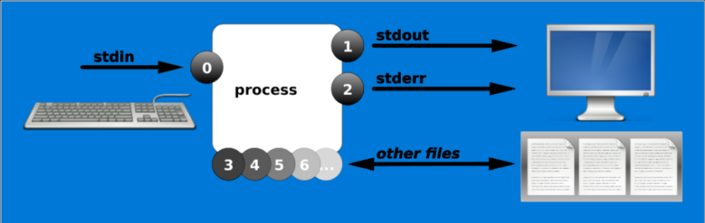
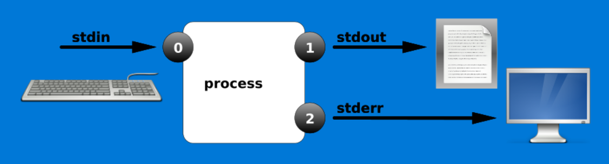
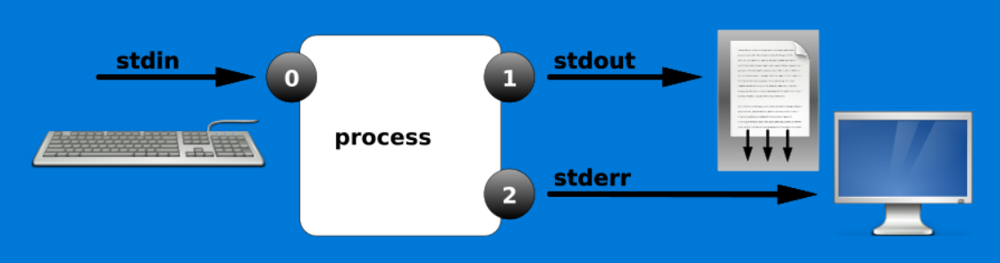
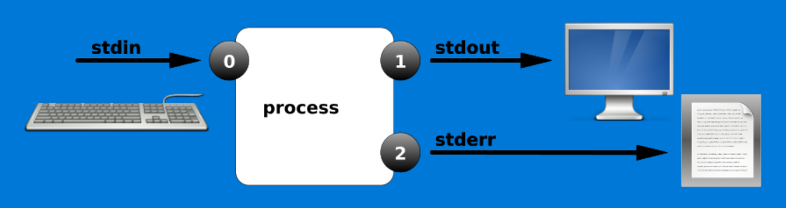
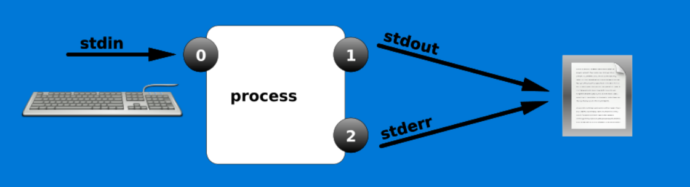
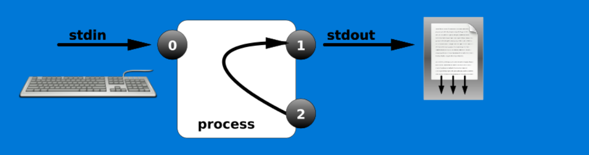
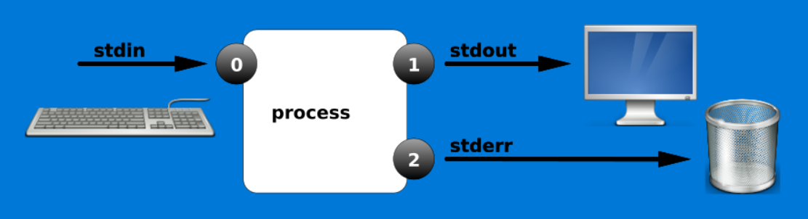
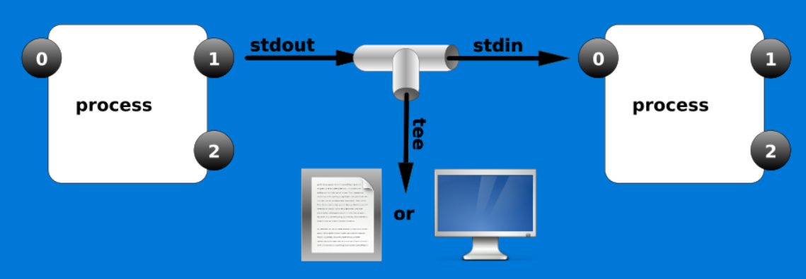

# 六.Linux-管道和重定向

## 1.简介
**重定向技术**是为了将命令进行组合使用以期提升工作效率，与文件读写操作相关的重定向技术有5种模式---<font color=red size=4 face="黑体" >标准覆盖输出重定向、标准追加输出重定向、错误覆盖输出重定向、错误追加输出重定 向以及输入重定向</font>。
<br/>
</img>
***
简而言之，**输入重定向**是指把文件导入到命令中，而**输出重定向**则是指把原本要输出到屏幕的数据信息写入到指定文件中。在日常的学习和工作中，相较于输入重定向，我们使用输出重定向的频率更高，所以又将输出重定向分为了**标准输出重定向**和**错误输出重定向**两种不同的技术，以及清空写入与追加写入两种模式。
<br/>
* **标准输入重定向**（STDIN，文件描述符为 0）：默认从键盘输入，也可从其他文件或命 令中输入。
* **标准输出重定向**（STDOUT，文件描述符为 1）：默认输出到屏幕。 
* **错误输出重定向**（STDERR，文件描述符为 2）：默认输出到屏幕。

**举例：**
```
[root@Alienware15 ~]# touch 1.md   
[root@Alienware15 ~]# ls -l 1.md  
-rw-r--r--. 1 root root 0 Aug 5 05:35 1.md  
[root@Alienware15 ~]# ls -l xxxxxx  
ls: cannot access xxxxxx: No such file or directory 
```
说明：第二个命令里1.md文件是存在的，输出信息是该文件的一些信息，这是ls命令的标准输出信息，而第三个命令xxxxxx文件并不存在，因此输出的是报错提示信息。这两种输出是不同的。  

**输入重定向中用到的符号及其作用**
<table>
    <tr>
        <td>符号</td>
        <td>作用</td>
    </tr>
    <tr>
        <td>命令 &lt 文件</td>
        <td>将文件作为命令的标准输入 </td>
    </tr>
    <tr>
        <td>命令 &lt&lt 分界符<</td>
        <td>从标准输入中读入，直到遇见分界符才停止 </td>
    </tr>
    <tr>
        <td>命令 &lt 文件1 &gt; 文件2<</td>
        <td>将文件 1 作为命令的标准输入并将标准输出到文件 2 </td>
    </tr>    
</table>  

**输出重定向中用到的符号及其作用**
<table>
    <tr>
        <td>符号</td>
        <td>作用</td>
    </tr>
    <tr>
        <td>命令 &gt; 文件</td>
        <td>将标准输出重定向到文件(清空原有文件的数据)</td>
    </tr>
    <tr>
        <td>命令 2&gt; 文件</td>
        <td>将错误输出重定向到文件(清空原有文件的数据)</td>
    </tr>
    <tr>
        <td>命令 &gt;&gt; 文件</td>
        <td>将标准输出重定向到文件(追加到原有内容后面)</td>
    </tr>    
    <tr>
        <td>命令 &gt;&gt;文件</td>
        <td>将错误输出重定向到文件(追加到原有内容后面)</td>
    </tr>
    <tr>
        <td>命令 &gt;&gt; 文件 2&gt;&1 或 命令 &&gt&gt文件<</td>
        <td>将标准与错误输出共同写入到文件(追加到原内容后面)</td>
    </tr>   
</table>

对于重定向中的标准输出模式，可以省略文件描述符 1 不写，而错误输出模式的文件描述符 2 是必须要写的

## 输出重定向例子
### 1.输出重定向(覆盖)
```
[root@localhost ~]# date 1> date.txt 
```
</img>

### 2.输出重定向(追加)
```
[root@localhost ~]# date >> date.txt 
```
</img>

### 3.错误输出重定向
```
[root@localhost ~]# ls /home/  /aaaaaaaaa >list.txt 
ls: 无法访问/aaaaaaaaa: 没有那个文件或目录
[root@localhost ~]# ls /home/  /aaaaaaaaa >list.txt 2>error.txt //重定向到不同的位置
```
</img>
### 4.正确和错误都输入到相同的位置
```
[root@localhost ~]# ls /home/  /aaaaaaaaa &>list.txt    //混合输出
```
</img>

### 5.正确和错误都输入到相同的位置
```
[root@localhost ~]# ls /home/  /aaaaaaaaa >list.txt 2>&1          //重定向到相同的位置
```
</img>

### 6.重定向到空设备/dev/null
```
[root@localhost ~]# ls /home/  /aaaaaaaaa >list.txt 2>/dev/null   //空设备，即将产生的输出丢掉
[root@localhost ~]# ls /home/  /aaaaaaaaa &>/dev/null             //空设备，即将产生的输出丢掉
```
</img>


```
特殊例子：
1：echo > test.txt   ???
2: > test.txt        ???
3: > /etc/passwd     ???
4: > /etc            ???

```

## 输入重定向例子
### 1.
```
[root@localhost y1]# grep 'root' < /etc/passwd
root:x:0:0:root:/root:/bin/bash
operator:x:11:0:operator:/root:/sbin/nologin

```
### 2.
```
[root@localhost y1]# mail -s "user list" yln < /etc/passwd
[yln@localhost ~]$ mail
Heirloom Mail version 12.5 7/5/10.  Type ? for help.
"/var/spool/mail/yln": 3 messages
>   1 root                  Wed May 23 14:46  19/649   "demo"
    2 root                  Wed May 23 14:49  20/765   "demo1"
    3 root                  Wed May 23 15:19  71/3381  "user list"
& 
^D

```
### 3.
```
[root@localhost ~]# dd </dev/zero >/file2.txt bs=1M count=20

```
创建了一个20M大小的文件，填充空字符

## 综合例子
### 1: 利用重定向建立多行的文件
```
[root@localhost ~]# echo "111" > file1.txt
[root@localhost ~]# cat file1.txt 
111

[root@localhost ~]# cat >file2.txt
111
222
333
444
^D
[root@localhost ~]# cat file2.txt 

***问：file2.txt有几行？***


[root@localhost ~]# cat >>file3.txt
aaa
bbb
ccc
ddd
^D
[root@localhost ~]# cat file3.txt 

***问：file3.txt有几行***

[root@localhost ~]# cat >file4 <<EOF
> 111
> 222
> 333
> EOF
[root@localhost ~]# cat file4
111
222
333
```
### 2.脚本中利用重定向打印消息
```
#!/usr/bin/bash
cat <<-EOF
+-----------------------------------------------+
|                                               |
|              ======================           |
|                    M.O.S系统                  |
|                             by ZAFT           |
|              ======================           |
|              1. 核动力核心启动                |             
|              2. 加载精神反射界面              |
|              3. 插入插入栓                    |
|              5. 驾驶员神经网络链接            |
|              6. 战斗模式                      | 
|                                               |
+-----------------------------------------------+

+-----------------------------------------------+
|                                               |
|              ======================           |
|               centos虚拟机基本管理                  |
|                           by ZAFT           |
|              ======================           |
|              1. 安装虚拟机                |             
|              2. 重置所有Linux虚拟机              |
|              3. 重置Windows虚拟机                    |
|              5. 重置指定的虚拟机            |
|              6. 推出管理程序                      | 
|                                               |
+-----------------------------------------------+
EOF

```

## 额外
**命令行通配符**
<table>
    <tr>
        <td>通配符</td>
        <td>意思</td>
    </tr>
    <tr>
        <td>*</td>
        <td>匹配零个或多个字符 </td>
    </tr>
    <tr>
        <td>？</td>
        <td>匹配任意单个字符 </td>
    </tr>
    <tr>
        <td>[0-9]</td>
        <td>匹配范围内的数字 </td>
    </tr>   
    <tr>
        <td>[abc]</td>
        <td>匹配已给出的任意字符 </td>
    </tr> 
</table> 

### 例子
```
查看sda开头的所有设备文件：
[root@localhost ~]# ls /dev/sda*
/dev/sda /dev/sda1 /dev/sda2
查看sda后面有一个字符的设备文件：
[root@localhost ~]# ls /dev/sda?
/dev/sda1 /dev/sda2
查看sda后面包含0-9数字的设备文件：
[root@localhost ~]# ls /dev/sda[0-9]
/dev/sda1 /dev/sda2
查看sda后面是1或3或5的设备文件：
[root@localhost ~]# ls /dev/sda[135]
/dev/sda1
```
**转义字符**
<table>
    <tr>
        <td>字符</td>
        <td>作用</td>
    </tr>
    <tr>
        <td>\(反斜杠)</td>
        <td>转义后面单个字符 </td>
    </tr>
    <tr>
        <td>''(单引号)/td>
        <td>转义后面所有字符 </td>
    </tr>
    <tr>
        <td>""(双引号)</td>
        <td>变量依然生效 </td>
    </tr>   
    <tr>
        <td>``(反引号)</td>
        <td>执行命令语句 </td>
    </tr> 
</table> 

## 管道命令符
管道命令符的作 用也可以用一句话来概括“把前一个命令原本要输出到屏幕的标准正常数据当作是后一个命令的标准输入”
**进程管道**
用法：command1 | command2 |command3 |...

**几个会用到的命令**
1. wc:统计,使用方法:wc [选项] file
```
-c 字节数
-m 字符数
-l 行数
-L 最长行长度
-w 单词数

[root@localhost y1]# wc -l 1.txt
76 1.txt
[root@localhost y1]# wc -l < 1.txt
76
```
2. sort:排序
```
-t 指定分隔符
-k 指定列
-n 数字
-r 反向排序

[root@localhost ~]# sort -t":" -k3 -rn /etc/passwd    //逆序
```

## 例子
### 1.
* 统计/usr/bin/目录下的文件个数
```
[root@localhost ~]# ls -lR | grep '^-' | wc -l
12
```
### 2.
* 将/etc/passwd中的用户按UID大小排序
```
[root@localhost ~]# sort -t":" -k3 -n /etc/passwd       //以: 分隔，将第三列按字数升序
[root@localhost ~]# sort -t":" -k3 -n /etc/passwd -r    //逆序
[root@localhost ~]# sort -t":" -k3 -n /etc/passwd |head
```
### 3.
* 找出被限制登录用户的命令是 grep "/sbin/nologin" /etc/passwd； 
* 统计文本行数的命令则是 wc -l
```
[root@localhost y1]# grep "/sbin/nologin" /etc/passwd | wc -l
42

```

### 4.统计出最占CPU的5个进程
```
[root@localhost y1]# ps aux --sort=-%cpu |head -6
USER        PID %CPU %MEM    VSZ   RSS TTY      STAT START   TIME COMMAND
root       3900  3.0  0.1 151200  1948 pts/0    R+   15:53   0:00 ps aux --sort=-%cpu
root        933  0.1  0.3 305296  6292 ?        Ssl  14:11   0:07 /usr/bin/vmtoolsd
root          1  0.0  0.3 193832  7000 ?        Ss   14:10   0:03 /usr/lib/systemd/systemd --switched-root --system --deserialize 21
root          2  0.0  0.0      0     0 ?        S    14:10   0:00 [kthreadd]
root          3  0.0  0.0      0     0 ?        S    14:10   0:00 [ksoftirqd/0]
[root@localhost y1]# 

```
## tee管道
</img>  
tee:将标准输出拷贝到文件中，并且继续输出到标准输出
```
-a 追加

[root@localhost ~]# date |tee date.txt
Sat Mar 24 14:22:31 CST 2018

[root@localhost ~]# date |tee -a date.txt
Sat Mar 24 14:22:31 CST 2018
```


小练习:
1. 统计/usr/bin/目录下的文件个数
2. 取出/etc/inittab文件的第6行；
3. 取出/etc/passwd文件中倒数第9个用户的用户名和shell，显示到屏幕上并将其保存至/tmp/users文件中；
