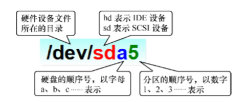

# 八.存储结构与磁盘划分

## 1.基础知识
* 从工作原理上存储设备分为机械结构和固态两种，
* 从磁盘尺寸分为3.5寸，2.5寸，1.8寸以及其它形态，
* 从插拔方式分为热拔插和非热拔插两种，
* 从接口分为IDE(ATA,PATA)---SATA(I/II/III),SCSI---SAS,PCIe,FC.
* 从存储连接方式分为本地存储，外部存储，网络存储。

* 从分区方式区分  
**MBR** (磁盘主引导记录Master Boot Record)[MBR介绍](<https://zh.wikipedia.org/wiki/%E4%B8%BB%E5%BC%95%E5%AF%BC%E8%AE%B0%E5%BD%95>)    
<2TB  fdisk  1-4个分区（4个主分区，扩展分区，逻辑分区）  
例如: 3主 + 1扩展（n逻辑）  
**GPT** (全局唯一标识分区表GUID Partition Table)[GPT介绍](<https://zh.wikipedia.org/wiki/GUID%E7%A3%81%E7%A2%9F%E5%88%86%E5%89%B2%E8%A1%A8>)  
\>2TB  gdisk(parted)  128个主分区  
**注意**：从MBR转到GPT，或从GPT转换到MBR会导致数据全部丢失！
  
  
0541-5491-5303

**IDE**:Integrated Drive Electronics,IDE是一种计算机系统接口，主要用于硬盘和CD-ROM，本意为“把控制器与盘体集成在一起的硬盘”。数年以前PC主机使用的硬盘，大多数都是IDE兼容的，而目前主要接口为SATA接口。而在SATA技术日益发展下，没有ATA的主板已经出现，而且Intel在新型的芯片组中已经不默认支持ATA接口。  
SATA（Serial ATA）于2002年推出后，原有的ATA改名为PATA（并行高技术配置，Parallel ATA）。2013年12月29日，西部数据正式停止PATA硬盘供应，而希捷科技则已停售产多年，这意味着1986年设计的PATA接口在经历27年后正式退出历史舞台.  

**SATA**:串行ATA（Serial ATA: Serial Advanced Technology Attachment）是一种电脑总线，主要用于个人电脑。串行ATA与串列SCSI（SAS: Serial Attached SCSI）的两者排线兼容，SATA硬盘可接上SAS接口。  
2000年11月由“Serial ATA Working Group”团体所制定，取代旧式PATA（Parallel ATA或旧称IDE）接口的旧式硬盘，因采用串行方式传输数据而得名。在数据传输上这一方面，SATA的速度比以往更加快捷，并支持热插拔，使电脑运作时可以插上或拔除硬件。另一方面，SATA总线使用嵌入式时钟频率信号，具备比以往更强的纠错能力，能对传输指令（不仅是数据）进行检查，如果发现错误会自动矫正，提高数据传输的可靠性。不过，SATA和以往最明显的分别，是使用较细的排线，有利机箱内部的空气流通，某程度上增加了整个平台的稳定性。  

现时，SATA分别有SATA 1.5Gbit/s、SATA 3Gbit/s和SATA 6Gbit/s三种规格。2013年推出更快速的SATA Express规格。  

**SCSI**:小型计算机系统接口（SCSI，Small Computer System Interface）是一种用于计算机及其周边设备之间（硬盘、软驱、光驱、打印机、扫描仪等）系统级接口的独立处理器标准。SCSI标准定义命令、通信协议以及实体的电气特性（换成OSI的说法，就是占据物理层、链接层、套接层、应用层），最大部分的应用是在存储设备上（例如硬盘、磁带机）；但，其实SCSI可以连接的设备包括有扫描仪、光学设备（像CD、DVD）、打印机……等等，SCSI命令中有条列出支持的设备SCSI周边设备。理论上，SCSI不可能连接所有的设备，所以有“1Fh - unknown or no device type”这个参数存在。  

**SAS**:SAS（Serial Attached SCSI，串列SCSI）是由并行SCSI物理存储接口演化而来，是由ANSI INCITS T10技术委员会开发的新的存储接口标准。与并行方式相比，串列方式提供更快速的通信传输速度以及更简易的配置。此外SAS支持与串列ATA设备兼容，且两者可以使用相类似的电缆。SATA的硬盘可接在SAS的控制器使用，但SAS硬盘并不能接在SATA的控制器使用。  

SAS是点对点（point-to-point）连接，并允许多个端口集中于单个控制器上，可以创建在主板（mother board）也可以另外添加。该技术创建在强大的并行SCSI通信技术基础上。SAS是采用SATA兼容的电缆线采取点对点连接方式，从而在计算机系统中不需要创建菊花链（daisy-chaining）方式便可简单地实现线缆安装。  

**PCIe**:PCI Express，简称PCI-E，官方简称PCIe，是电脑总线PCI的一种，它沿用现有的PCI编程概念及通信标准，但建基于更快的串行通信系统。 英特尔是该接口的主要支持者。PCIe仅应用于内部互连。由于PCIe是基于现有的PCI系统，只需修改物理层而无须修改软件就可将现有PCI系统转换为PCIe。 PCIe拥有更快的速率，以取代几乎全部现有的内部总线（包括AGP和PCI）。现在英特尔和AMD已采用单片机组技术，取代原有的南桥／北桥方案。除此之外，PCIe设备能够支持热拔插以及热交换特性，支持的三种电压分别为+3.3V、3.3Vaux以及+12V。  
PCIe只是南桥的扩展总线，它与操作系统无关，所以也保证它与原有PCI的兼容性，也就是说在很长一段时间内在主板上PCIe接口将和PCI接口共存，这也给用户的升级带来方便。由此可见，PCIe最大的意义在于它的通用性，不仅可以让它用于南桥和其他设备的连接，也可以延伸到芯片组间的连接，甚至也可以用于连接图形处理器，这样，整个I/O系统重新统一起来，将更进一步简化计算机系统，增加计算机的可移植性和模块化。

## 2.物理设备的名命规则
系统内核中的 udev 设备管理器会自动把硬件名称规范起来，目的是让用户通过设备文件的名字可以猜出设备大致的属性以及分区信息等。另外，udev 设备管理器的服务会一直以守护进程的形式运行并侦听内核发出的信号来管理/dev 目录下的设备文件.
<table>
    <tr>
        <td>硬件设备</td>
        <td>文件名称</td>
    </tr>
    <tr>
        <td>IDE设备</td>
        <td>/dev/hd[a-d]  </td>
    </tr>
    <tr>
        <td>SCSI/SATA/U盘</td>
        <td>/dev/sd[a-p]  </td>
    </tr>
    <tr>
        <td>软驱</td>
        <td>/dev/fd[0-1]   </td>
    </tr>
    <tr>
        <td>打印机</td>
        <td>/dev/lp[0-15]  </td>
    </tr>
    <tr>
        <td>光驱</td>
        <td>/dev/cdrom  </td>
    </tr>
    <tr>
        <td>鼠标</td>
        <td>/dev/mouse  </td>
    </tr>
    <tr>
        <td>磁带机</td>
        <td>/dev/st0 或/dev/ht0  </td>
    </tr>
</table> 

现在 IDE 设备已经很少见了，所以一般的硬盘设备都会是以“/dev/sd”开头的。而一台主机上可以有多块硬盘，因此系统采用 a～p 来代表 16 块不同的硬盘（默认从 a 开始 分配），而且硬盘的分区编号也有讲究：   
* 主分区或扩展分区的编号从 1 开始，到 4 结束；
* 逻辑分区从编号 5 开始。 
</img>

**硬盘简介：**  
硬盘是由大量的扇区组成的，每个扇区的容量为 512 字节。其中第一个扇区最重要，它里面保存着主引导记录与分区表信息。就第一个扇区来讲，主引导记录需要占用 446 字节，分区表为 64 字节，结束符占用 2 字节；其中分区表中每记录一个分区信息就需要 16 字节，这样一来最多只有 4 个分区信息可以写到第一个扇区中，这 4 个分区就 是 4 个主分区  
</img>  

<font color=red>最多只能创建出 4 个分区?</font>  
为了解决分区个数不够 的问题，可以将第一个扇区的分区表中 16 字节（原本要写入主分区信息）的空间（称之为扩 展分区）拿出来指向另外一个分区。也就是说，扩展分区其实并不是一个真正的分区，而更像 是一个占用 16 字节分区表空间的指针—一个指向另外一个分区的指针。这样一来，用户一 般会选择使用 3 个主分区加 1 个扩展分区的方法，然后在扩展分区中创建出数个逻辑分区， 从而来满足多分区（大于 4 个）的需求
</img>

## 3.文件系统
用户在硬件存储设备中执行的文件创建、写入、读取、修改、转存与控制等操作都是依靠文件系统来完成的。文件系统的作用是合理规划硬盘，以保证用户正常的使用需求。Linux 系统支持数十种的文件系统，而最常见的文件系统是**Ext3，Ext4**.
* **Ext3**：是一款日志文件系统，能够在系统异常宕机时避免文件系统资料丢失，并能自动修复数据的不一致与错误。然而，当硬盘容量较大时，所需的修复时间也会很长，而且也不能百分之百地保证资料不会丢失。它会把整个磁盘的每个写入动作的细节都预先记录下来，以便在发生异常宕机后能回溯追踪到被中断的部分，然后尝试进行修复。最大支持16TB，单个文件最大2TB。
* **Ext4**：Ext3 的改进版本，作为 RHEL 6 系统中的默认文件管理系统，它支持的存储容量高达 1EB（1EB=1,073,741,824GB），且能够有无限多的子目录。另外，Ext4 文件系统能够批量分配 block 块，从而极大地提高了读写效率.最大支持16TB，单个文件最大16TB。
* **XFS**：是一种高性能的日志文件系统，而且是 RHEL 7 中默认的文件管理系统，它的优势在发生意外宕机后尤其明显，即可以快速地恢复可能被破坏的文件，而且强大的日志功能只用花费极低的计算和存储性能。并且它最大可支持的存储容量为 18EB，这几乎满足了所有需求.
- - -
- - -
- - -
</img>

Linux 系统中有一个 super block 的“硬盘地图”。Linux 并不是把文件内容直接写入到这个“硬盘地图”里面，而是在里面记录着整个文件系统的信息。因为如果把所有的文件内容都写入到这里面，它的体积将变得非常大， 而且文件内容的查询与写入速度也会变得很慢。Linux 只是把每个文件的权限与属性记录在<font color=red> inode </font> 中，而且每个文件占用一个独立的<font color=red> inode </font>表格，该表格的大小默认为 128 字节，里面记录着如下信息:
>* 该文件的访问权限（read、write、execute）
>* 该文件的所有者与所属组（owner、group）
>* 该文件的大小（size）
>* 该文件的创建或内容修改时间（ctime）
>* 该文件的最后一次访问时间（atime）
>* 该文件的修改时间（mtime）
>* 文件的特殊权限（SUID、SGID、SBIT）
>* 该文件的真实数据地址（point）
- - -
文件的实际内容则保存在<font color=red> block </font>块中（大小可以是 1KB、2KB 或 4KB），一个<font color=red> inode </font>的默认大小仅为 128B（Ext3），记录一个<font color=red> block </font>则消耗 4B。当文件的<font color=red> inode </font>被写满后，Linux 系统会自动分配出一个<font color=red> block </font>块，专门用于像<font color=red> inode </font>那样记录其他<font color=red> block </font>块的信息，这样把各个<font color=red>block </font>块的内容串到一起，就能够让用户读到完整的文件内容了。

</img>
* 目录项:包括文件名和inode节点号。
* Inode：又称文件索引节点，是文件基本信息的存放地和数据块指针存放地。
* 数据块：文件的具体内容存放地。

- - -
### 查看文件系统信息
* **lsblk**:列出所有可用块设备的信息并显示他们之间的依赖关系。  
lsblk输出各字段意义:
</img>
> <font color=blue size=4>NAME</font> : 这是块设备名。  
> <font color=blue size=4>MAJ:MIN</font> : 主要和次要设备号。  
> <font color=blue size=4>RM</font> : 设备是否可移动设备。注意，在本例中设备sdb和sr0的RM值等于1，这说明他们是可移动设备。  
> <font color=blue size=4>SIZE</font> : 设备的容量大小信息。例如298.1G表明该设备大小为298.1GB，而1K表明该设备大小为1KB。  
> <font color=blue size=4>RO</font> : 设备是否为只读。在本案例中，所有设备的RO值为0，表明他们不是只读的。  
> <font color=blue size=4>TYPE</font> :块设备是否是磁盘或磁盘上的一个分区。在本例中，sda和sdb是磁盘，而sr0是只读存储（rom）。  
> <font color=blue size=4>MOUNTPOINT</font> : 设备挂载的挂载点。
- - -
**df**:显示磁盘分区上的可使用的磁盘空间。默认显示单位为KB,
>* -T  显示文件系统的类型
>* -h  以可读性较高的方式来显示信息
>* -l  仅显示本地端的文件系统  

</img>
- - -
* **blkid**:查询设备上所采用文件系统类型,主要用来对系统的块设备（包括交换分区）所使用的文件系统类型、LABEL、UUID等信息进行查询(必须e2fsprogs软件包)
</img>
- - -

先确认当前系统的文件系统格式，df -Th，blkid, 

* **dumpe2fs**:ext3/4文件系统使用这个 
* **tune2fs**:调整和查看ext2/ext3文件系统的文件系统,参数-l
* **xfs_info**:xfs文件系统使用这个    
- - -

## 3.Linux分区步骤: 
**创建分区（fdisk）---格式化（mkfs）---挂载（mount）--- 卸载(umount)**
其中MBR分区使用fdisk,GPT分区使用gdisk
- - -
## 3.0 确认分区
### MBR:fdisk
```
[root@localhost d2]# fdisk -l
```
## 3.1.创建分区&格式化
### fdisk
fdisk命令用于管理磁盘分区，格式为“**fdisk [磁盘名称]**”，具有添加、删除、转换分区等功能。而且是交互式的。  
**参数意思：**
<table>
    <tr>
        <td>参数</td>
        <td>作用</td>
    </tr>
    <tr>
        <td>m</td>
        <td>查看全部可用的参数 </td>
    </tr>
    <tr>
        <td>n</td>
        <td>添加新的分区 </td>
    </tr>
    <tr>
        <td>d</td>
        <td>删除某个分区信息 </td>
    </tr>
    <tr>
        <td>l</td>
        <td>列出所有可用的分区类型 </td>
    </tr>
    <tr>
        <td>t</td>
        <td>改变某个分区的类型 </td>
    </tr>
    <tr>
        <td>p</td>
        <td>查看分区信息 </td>
    </tr>
    <tr>
        <td>w</td>
        <td>保存并退出 </td>
    </tr>
    <tr>
        <td>q</td>
        <td>不保存直接退出 </td>
    </tr>
</table>  

### mkfs
格式化，格式为“**mkfs [选项] [-t <类型>] [设备]**”
* mkfs.xfs /dev/sdb1
* mkfs -t xfs /dev/sdb1
```
例子1:创建一个500MB的主分区
[root@localhost d2]# fdisk /dev/sdb
n
p

例子2:创建一个2GB的拓展分区
[root@localhost d2]# fdisk /dev/sdb
e

例子3:2GB的拓展分区中创建逻辑分区两个300MB，500MB
[root@localhost d2]# fdisk /dev/sdb
n
l

例子4:格式化500MB(例子1)的主分区
[root@localhost d2]# mkfs -t xfs /dev/sdb1

例子5：挂载
  1）创建一个挂载点（目录）
[root@localhost d2]# mkdir /tools
  2）挂载
[root@localhost d2]# mount /dev/sdb1 /tools/
  3）查看
[root@localhost d2]# mount | tail -1
  或
[root@localhost d2]# df -h | grep tools


现在根目录就会有一个文件夹可以正常使用了，其背后是新添加的那块硬盘

例子6：卸载,使用设备名或者挂载点
[root@localhost d2]# umount /tools/
或
[root@localhost d2]# umount /dev/sdb1
```

## 3.2.挂载分区&卸载分区
### mount
mount 命令用于挂载文件系统，挂载是在使用硬件设备前所执行的最后一步操作。只需使用 mount 命令把硬盘设备或分区与一个目录文件进行关联，然后就能在这个目录中看到硬件设备中的数据了。  
命令格式为"**mount [文件系统] [挂载目录]**"。
>* -d  改变显示的更新速度，或是在交谈式指令列按s
>* -n  更新的次数，完成后退出>
- - - 
* 例1. 把设备/dev/sda1挂载到/home/user1目录下：
```
[root@localhost d2]# mount /dev/sda1 /home/user1
[root@localhost d2]# 
```
- - -
以上示例在系统重启后挂载就会失效，即每次开机均需手动挂载。不方便不现实。永久挂载则必须按照指定的格式“**设备文件 挂载目录 格式类型 权限选项 是否备份 是否自检**”写入到<font color=red size=5>/etc/fstab</font>文件中。

> **/etc/fstab** 文件负责配置Linux开机时自动挂载的分区，某些时候当Linux系统下划分了新的分区后，需要将这些分区设置为开机自动挂载，否则，linux是无法使用新建的分区的。磁盘分区都必须挂载到目录树中的某个具体的目录上才能进行读写操作，而fstab正是负责这一配置。
* * *
**挂载信息的指定填写格式中各字段意义**
<table>
    <tr>
        <td>字段</td>
        <td>意义</td>
    </tr>
    <tr>
        <td>设备文件</td>
        <td>一般为设备的路径+设备名称，也可以写唯一识别码(UUID,Universally Unique Identifier)</td>
    </tr>
    <tr>
        <td>挂载目录</td>
        <td>指定要挂载到的目录，需在挂载前创建好</td>
    </tr>
    <tr>
        <td>权限选项</td>
        <td>若设置为defaults，则默认权限为：rw,suid,dev,exec,auto,nouser,async</td>
    </tr>
    <tr>
        <td>是否备份</td>
        <td>若为1则开机后使用dump进行磁盘备份，为0则不备份 </td>
    </tr>
    <tr>
        <td>是否自检</td>
        <td>若为 1 则开机后自动进行磁盘自检，为 0 则不自检 </td>
    </tr>
</table>  

**常见的挂载选项**  
*  rw :  读写
*  ro :  只读
*  suid : 支持suid
*  dev : 支持设备文件
*  nodev : 不支持设备文件
*  noexec : 不允许执行二进制文件
*  exec : 允许执行二进制
*  auto : mount -a 开机自动加载
*  noauto : mount -a 开机不自动加载
*  async : 异步写入
*  sync : 同步写入
*  usrquota : 支持用户级磁盘配额功能
*  grpquota : 支持组级磁盘配额功能
*  acl : 支持acl功能
*  remount : 在线重新挂载
*  pri : 指定优先级

- - - 
* 例2. 满足例1的条件，并且保持默认权限无需开机自检：
```
[root@localhost d2]# vim /etc/fstab 
# 
# /etc/fstab 
# Created by anaconda on Fri May 25 13:35:16 2018 
# 
# Accessible filesystems, by reference, are maintained under '/dev/disk' 
# See man pages fstab(5), findfs(8), mount(8) and/or blkid(8) for more info 
# 
/dev/mapper/centos-root     /            xfs       defaults   1 1 UUID=812b1f7c-8b5b-43da-8c06-b9999e0fe48b /boot        xfs       defaults   1 2 
/dev/mapper               /centos-swap   swap swap defaults   0 0 
/dev/cdrom                /media/cdrom iso9660   defaults   0 0 
/dev/sda1                 /home/user1    ext4      defaults   0 0
```
- - -
* 例3. 使用卷标挂载：
```
[root@localhost d2]# tune2fs -l /dev/vda1 |less
Filesystem volume name:   <none>

[root@localhost d2]# tune2fs -L yang /dev/sda3    //设置卷标LABEL
tune2fs 1.39 (29-May-2006)
[root@localhost d2]# vim /etc/fstab
LABEL=yang          /mnt/disk1      ext4    defaults    0 0
```
- - -
* 例4. 使用UUID挂载：
```
[root@localhost ~]# blkid /dev/sda5
/dev/sda5: UUID="353a34b8-9233-465c-b7cf-92c8d308c05b" SEC_TYPE="ext2" TYPE="ext3" 
[root@localhost ~]# vim /etc/fstab
UUID="353a34b8-9233-465c-b7cf-92c8d308c05b"  /mnt/disk1   ext4  defaults   0 0
```
- - -
### 附加---挂载ISO文件
```
1. 将光盘制作成iso
[root@localhost ~]# dd if=/dev/cdrom of=/myiso.iso
[root@localhost ~]# dd </dev/cdrom >/myiso.iso

2. 将文件制作成iso,例如将/etc制作成etc.iso
[root@localhost ~]# genisoimage -o /y1/etc.iso -r /etc
[root@localhost ~]# file /tmp/etc.iso 
/var/etc.iso: ISO 9660 CD-ROM filesystem data 'CDROM'

3. 使用iso,挂载
[root@localhost ~]# mount -t iso9660 -o loop /tmp/etc.iso /mnt/iso/4. 
```
- - -
### umount
用于撤销已经挂载的设备文件。挂载文件系统的目的是为了使用硬件资源，而卸载文件系统就是不再使用硬件的设备资源；相对应地，挂载操作就是把硬件设备与目录进行关联的动作，而卸载操作只需要说明想要取消关联的设备文件或挂载目录的其中一项即可，一般不需要加其他额外的参数。格式为“**umount [挂载点/设备文件]**”。
* 例1. 上一小节的例子（把设备/dev/sda1挂载到/home/user1目录下），现在卸载，以下两种方式都可以：
```
[root@localhost d2]# umount /dev/sda1 
[root@localhost d2]# umount /home/user1
```


## 5.LVM
## 6.RAID
RAID（独立冗余磁盘阵列） 是 Redundant Array of Independent Disks的缩写形式。
## 7.
